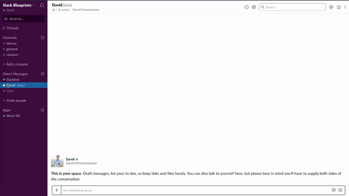

# Onboarding (`app_home_opened` event)

  
*`app_home_opened` event example*

🎥 [High Resolution screencast](app-home-opened.mp4)

💻 [Check out code example on Glitch](https://glitch.com/~app-home-opened)

## Description

Your Slack app lives in a virtual place called an App Home. Users find it by locating or adding your app in their channel sidebar, under the Apps heading.

Your App Home is essentially a private, 1:1 conversation between a person and your bot user. It works just like a direct message between two users, using the same events and Web API methods.

By enabling the `app_home_opened` event you are able to greet users with interactive, educational experiences and unlock the full potential of your App Home.

More information around App Home can be found on our [API docs](https://api.slack.com/reference/app-home).

_Please note that this event only works in your app's DM._

### Examples

* Onboarding new users once they open your App's DM for the first time
* Send a help message with important Call-to-actions once they open your App's DM

## Required features

* [Bot User](https://api.slack.com/bot-users)
* [Interactive Components](https://api.slack.com/interactive-messages)
* [Events API](https://api.slack.com/events-api)

## Required scopes

* [`bot`](https://api.slack.com/scopes/bot)

## Required event subscriptions

* [`app_home_opened`](https://api.slack.com/events/app_home_opened)

## Implementation overview

### 1. Show a welcome message once users open your App's DM for the first time

* [payload.json](payload-welcome.json)
* [Open in Block Kit Builder](https://api.slack.com/tools/block-kit-builder?blocks=%5B%7B%22type%22%3A%22section%22%2C%22text%22%3A%7B%22type%22%3A%22mrkdwn%22%2C%22text%22%3A%22Hey%20there%20%F0%9F%91%8B%20I%27m%20TaskBot.%20I%27m%20here%20to%20help%20you%20create%20and%20manage%20tasks%20in%20Slack.%5CnThere%20are%20two%20ways%20to%20quickly%20create%20tasks%3A%22%7D%7D%2C%7B%22type%22%3A%22section%22%2C%22text%22%3A%7B%22type%22%3A%22mrkdwn%22%2C%22text%22%3A%22*1%EF%B8%8F%E2%83%A3%20Use%20the%20%60%2Ftask%60%20command*.%20Type%20%60%2Ftask%60%20followed%20by%20a%20short%20description%20of%20your%20tasks%20and%20I%27ll%20ask%20for%20a%20due%20date%20(if%20applicable).%20Try%20it%20out%20by%20using%20the%20%60%2Ftask%60%20command%20in%20this%20channel.%22%7D%7D%2C%7B%22type%22%3A%22section%22%2C%22text%22%3A%7B%22type%22%3A%22mrkdwn%22%2C%22text%22%3A%22*2%EF%B8%8F%E2%83%A3%20Use%20the%20_Create%20a%20Task_%20action.*%20If%20you%20want%20to%20create%20a%20task%20from%20a%20message%2C%20select%20%60Create%20a%20Task%60%20in%20a%20message%27s%20context%20menu.%20Try%20it%20out%20by%20selecting%20the%20_Create%20a%20Task_%20action%20for%20this%20message%20(shown%20below).%22%7D%7D%2C%7B%22type%22%3A%22image%22%2C%22title%22%3A%7B%22type%22%3A%22plain_text%22%2C%22text%22%3A%22Create%20a%20task%22%2C%22emoji%22%3Atrue%7D%2C%22image_url%22%3A%22https%3A%2F%2Fapi.slack.com%2Fimg%2Fblocks%2Fbkb_template_images%2FonboardingComplex.jpg%22%2C%22alt_text%22%3A%22image1%22%7D%2C%7B%22type%22%3A%22section%22%2C%22text%22%3A%7B%22type%22%3A%22mrkdwn%22%2C%22text%22%3A%22%E2%9E%95%20To%20start%20tracking%20your%20team%27s%20tasks%2C%20*add%20me%20to%20a%20channel*%20and%20I%27ll%20introduce%20myself.%20I%27m%20usually%20added%20to%20a%20team%20or%20project%20channel.%20Type%20%60%2Finvite%20%40TaskBot%60%20from%20the%20channel%20or%20pick%20a%20channel%20on%20the%20right.%22%7D%2C%22accessory%22%3A%7B%22type%22%3A%22conversations_select%22%2C%22placeholder%22%3A%7B%22type%22%3A%22plain_text%22%2C%22text%22%3A%22Select%20a%20channel...%22%2C%22emoji%22%3Atrue%7D%7D%7D%2C%7B%22type%22%3A%22divider%22%7D%2C%7B%22type%22%3A%22actions%22%2C%22elements%22%3A%5B%7B%22type%22%3A%22button%22%2C%22text%22%3A%7B%22type%22%3A%22plain_text%22%2C%22text%22%3A%22Create%20a%20new%20task%22%2C%22emoji%22%3Atrue%7D%2C%22style%22%3A%22primary%22%2C%22value%22%3A%22click_me%22%7D%2C%7B%22type%22%3A%22button%22%2C%22text%22%3A%7B%22type%22%3A%22plain_text%22%2C%22text%22%3A%22View%20tasks%22%2C%22emoji%22%3Atrue%7D%2C%22value%22%3A%22click_me%22%7D%2C%7B%22type%22%3A%22button%22%2C%22text%22%3A%7B%22type%22%3A%22plain_text%22%2C%22text%22%3A%22Help%22%2C%22emoji%22%3Atrue%7D%2C%22value%22%3A%22click_me%22%7D%5D%7D%5D)

#### Methods

* [`chat.postMessage`](https://api.slack.com/methods/chat.postMessage)

### 2. Show a help message when a user opens your App's DM

_Note: Only post a help message if there was some considerable time between the last interaction with the user and the last message wasn't a help message itself. Additionally give the user an option to opt-out of these messages by e.g. providing a "Don't show this again" button_

* [payload.json](payload-help.json)
* [Open in Block Kit Builder](https://api.slack.com/tools/block-kit-builder?blocks=%5B%7B%22type%22%3A%22section%22%2C%22text%22%3A%7B%22type%22%3A%22mrkdwn%22%2C%22text%22%3A%22%3Awave%3A%20*Hi%20there!*%5Cn%5Cn%20Here%20are%20some%20actions%20you%20can%20take%20from%20here.%22%7D%7D%2C%7B%22type%22%3A%22section%22%2C%22text%22%3A%7B%22type%22%3A%22mrkdwn%22%2C%22text%22%3A%22%F0%9F%93%8B%20*List%20tasks*%20%5Cn%5Cn%20View%20a%20list%20of%20tasks%22%7D%2C%22accessory%22%3A%7B%22type%22%3A%22static_select%22%2C%22placeholder%22%3A%7B%22type%22%3A%22plain_text%22%2C%22text%22%3A%22Choose%20task%20list%22%2C%22emoji%22%3Atrue%7D%2C%22options%22%3A%5B%7B%22text%22%3A%7B%22type%22%3A%22plain_text%22%2C%22text%22%3A%22Due%20today%22%2C%22emoji%22%3Atrue%7D%2C%22value%22%3A%22value-1%22%7D%2C%7B%22text%22%3A%7B%22type%22%3A%22plain_text%22%2C%22text%22%3A%22My%20tasks%22%2C%22emoji%22%3Atrue%7D%2C%22value%22%3A%22value-2%22%7D%2C%7B%22text%22%3A%7B%22type%22%3A%22plain_text%22%2C%22text%22%3A%22All%20tasks%22%2C%22emoji%22%3Atrue%7D%2C%22value%22%3A%22value-2%22%7D%5D%7D%7D%2C%7B%22type%22%3A%22section%22%2C%22text%22%3A%7B%22type%22%3A%22mrkdwn%22%2C%22text%22%3A%22%E2%9A%99%EF%B8%8F%20*Settings*%20%5Cn%5Cn%20Edit%20your%20settings%20or%20notification%20preferences%22%7D%2C%22accessory%22%3A%7B%22type%22%3A%22static_select%22%2C%22placeholder%22%3A%7B%22type%22%3A%22plain_text%22%2C%22text%22%3A%22Edit%20settings%22%2C%22emoji%22%3Atrue%7D%2C%22options%22%3A%5B%7B%22text%22%3A%7B%22type%22%3A%22plain_text%22%2C%22text%22%3A%22Notifications%22%2C%22emoji%22%3Atrue%7D%2C%22value%22%3A%22value-1%22%7D%2C%7B%22text%22%3A%7B%22type%22%3A%22plain_text%22%2C%22text%22%3A%22Settings%22%2C%22emoji%22%3Atrue%7D%2C%22value%22%3A%22value-2%22%7D%5D%7D%7D%2C%7B%22type%22%3A%22section%22%2C%22text%22%3A%7B%22type%22%3A%22mrkdwn%22%2C%22text%22%3A%22%F0%9F%93%A5%20*Send%20feedback*%20%5Cn%5Cn%20Give%20us%20feedback%20or%20ask%20for%20help%22%7D%2C%22accessory%22%3A%7B%22type%22%3A%22button%22%2C%22text%22%3A%7B%22type%22%3A%22plain_text%22%2C%22text%22%3A%22Send%20feedback%22%7D%2C%22value%22%3A%22click_me_123%22%7D%7D%2C%7B%22type%22%3A%22divider%22%7D%2C%7B%22type%22%3A%22actions%22%2C%22elements%22%3A%5B%7B%22type%22%3A%22button%22%2C%22text%22%3A%7B%22type%22%3A%22plain_text%22%2C%22text%22%3A%22Create%20a%20new%20task%22%2C%22emoji%22%3Atrue%7D%2C%22style%22%3A%22primary%22%2C%22value%22%3A%22click_me%22%7D%2C%7B%22type%22%3A%22button%22%2C%22text%22%3A%7B%22type%22%3A%22plain_text%22%2C%22text%22%3A%22FAQ%22%2C%22emoji%22%3Atrue%7D%2C%22value%22%3A%22click_me_123%22%7D%5D%7D%5D)

#### Methods

* [`chat.postMesssage`](https://api.slack.com/methods/chat.postMessage)
