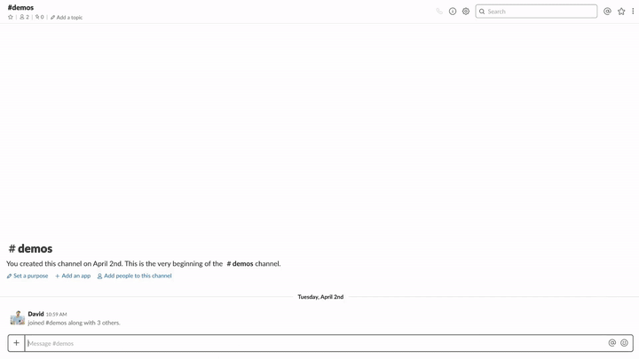

# Help menu (`app_mention` event)

  
*`app_mention` event example*

🎥 [High Resolution screencast](app-mention.mp4)

## Description

This event allows your app to subscribe to message events that directly mention your bot user in any channel or DM. This event contains the full text of the message in which your bot user was mentioned. You can both react to specific commands or respond with a general help message.

More information around `app_mention` can be found on our [API docs](https://api.slack.com/events/app_mention).

### Examples

* Offer a help menu when your App is mentioned in a channel

## Required features

* [Bot User](https://api.slack.com/bot-users)
* [Interactive Components](https://api.slack.com/interactive-messages)
* [Events API](https://api.slack.com/events-api)

## Required scopes

* [`bot`](https://api.slack.com/scopes/bot)

## Required event subscriptions

* [`app_mention`](https://api.slack.com/events/app_mention)

## Implementation overview

### 1. Add a reaction to the user's message

_Note: When sending the help message as an ephemeral message, only the user who mentioned your App can see this message. You can optionally add a reaction to the user's message so other users in this channel can see that your App is responding._ 

#### Methods

* [`reactions.add`](https://api.slack.com/methods/reactions.add)

### 2. Show an ephemeral help message 

* [payload.json](payload-help.json)
* [Open in Block Kit Builder](https://api.slack.com/tools/block-kit-builder?blocks=%5B%7B%22type%22%3A%22section%22%2C%22text%22%3A%7B%22type%22%3A%22mrkdwn%22%2C%22text%22%3A%22%3Awave%3A%20*Hi%20%3Cfakelink.toUser.com%7C%40David%3E!*%5Cn%20Here%27s%20a%20list%20of%20actions%20you%20can%20take%20from%20here%3A%22%7D%7D%2C%7B%22type%22%3A%22divider%22%7D%2C%7B%22type%22%3A%22section%22%2C%22text%22%3A%7B%22type%22%3A%22mrkdwn%22%2C%22text%22%3A%22%F0%9F%93%8B%20*List%20tasks*%20%5Cn%5Cn%20View%20a%20list%20of%20tasks%22%7D%2C%22accessory%22%3A%7B%22type%22%3A%22static_select%22%2C%22placeholder%22%3A%7B%22type%22%3A%22plain_text%22%2C%22text%22%3A%22Choose%20task%20list%22%2C%22emoji%22%3Atrue%7D%2C%22options%22%3A%5B%7B%22text%22%3A%7B%22type%22%3A%22plain_text%22%2C%22text%22%3A%22Due%20today%22%2C%22emoji%22%3Atrue%7D%2C%22value%22%3A%22value-1%22%7D%2C%7B%22text%22%3A%7B%22type%22%3A%22plain_text%22%2C%22text%22%3A%22My%20tasks%22%2C%22emoji%22%3Atrue%7D%2C%22value%22%3A%22value-2%22%7D%2C%7B%22text%22%3A%7B%22type%22%3A%22plain_text%22%2C%22text%22%3A%22All%20tasks%22%2C%22emoji%22%3Atrue%7D%2C%22value%22%3A%22value-2%22%7D%5D%7D%7D%2C%7B%22type%22%3A%22section%22%2C%22text%22%3A%7B%22type%22%3A%22mrkdwn%22%2C%22text%22%3A%22%F0%9F%93%A5%20*Send%20feedback*%20%5Cn%5Cn%20Give%20us%20feedback%20or%20ask%20for%20help%22%7D%2C%22accessory%22%3A%7B%22type%22%3A%22button%22%2C%22text%22%3A%7B%22type%22%3A%22plain_text%22%2C%22text%22%3A%22Send%20feedback%22%7D%2C%22value%22%3A%22click_me_123%22%7D%7D%2C%7B%22type%22%3A%22divider%22%7D%2C%7B%22type%22%3A%22actions%22%2C%22elements%22%3A%5B%7B%22type%22%3A%22button%22%2C%22text%22%3A%7B%22type%22%3A%22plain_text%22%2C%22text%22%3A%22Create%20a%20new%20task%22%2C%22emoji%22%3Atrue%7D%2C%22style%22%3A%22primary%22%2C%22value%22%3A%22create_task%22%7D%2C%7B%22type%22%3A%22button%22%2C%22text%22%3A%7B%22type%22%3A%22plain_text%22%2C%22text%22%3A%22FAQ%22%2C%22emoji%22%3Atrue%7D%2C%22value%22%3A%22click_me_123%22%7D%5D%7D%5D)

#### Methods

* [`chat.postEphemeral`](https://api.slack.com/methods/chat.postEphemeral)

