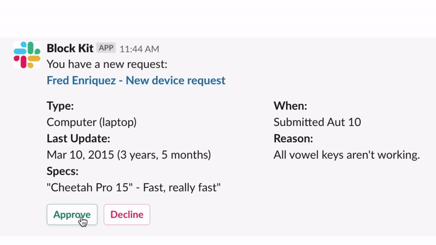
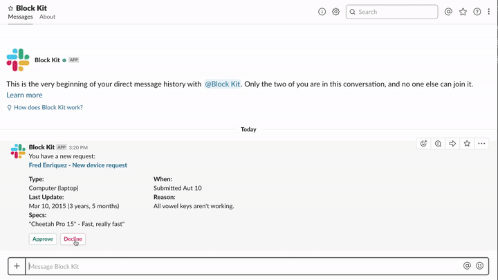

# Approval

  
*Approval confirmation*

🎥 [High Resolution screencast](approval-confirm.mp4)

  
*Approval rejection*

🎥 [High Resolution screencast](approval-reject.mp4)

### Examples

* Confirmation of a reservation, booking or appointment
* Action which requires manager's approval

## Required features

* [Bot User](https://api.slack.com/bot-users)
* [Interactive Components](https://api.slack.com/interactive-messages)

## Required scopes

* [`bot`](https://api.slack.com/scopes/bot)

## Implementation overview

### 1. Approval request

* [payload.json](payload-approval-request.json)
* [Open in Block Kit Builder](https://api.slack.com/tools/block-kit-builder?blocks=%5B%0A%09%7B%0A%09%09%22type%22%3A%20%22section%22%2C%0A%09%09%22text%22%3A%20%7B%0A%09%09%09%22type%22%3A%20%22mrkdwn%22%2C%0A%09%09%09%22text%22%3A%20%22You%20have%20a%20new%20request%3A%5Cn*%3CfakeLink.toEmployeeProfile.com%7CFred%20Enriquez%20-%20New%20device%20request%3E*%22%0A%09%09%7D%0A%09%7D%2C%0A%09%7B%0A%09%09%22type%22%3A%20%22section%22%2C%0A%09%09%22fields%22%3A%20%5B%0A%09%09%09%7B%0A%09%09%09%09%22type%22%3A%20%22mrkdwn%22%2C%0A%09%09%09%09%22text%22%3A%20%22*Type%3A*%5CnComputer%20(laptop)%22%0A%09%09%09%7D%2C%0A%09%09%09%7B%0A%09%09%09%09%22type%22%3A%20%22mrkdwn%22%2C%0A%09%09%09%09%22text%22%3A%20%22*When%3A*%5CnSubmitted%20Aut%2010%22%0A%09%09%09%7D%2C%0A%09%09%09%7B%0A%09%09%09%09%22type%22%3A%20%22mrkdwn%22%2C%0A%09%09%09%09%22text%22%3A%20%22*Last%20Update%3A*%5CnMar%2010%2C%202015%20(3%20years%2C%205%20months)%22%0A%09%09%09%7D%2C%0A%09%09%09%7B%0A%09%09%09%09%22type%22%3A%20%22mrkdwn%22%2C%0A%09%09%09%09%22text%22%3A%20%22*Reason%3A*%5CnAll%20vowel%20keys%20aren%27t%20working.%22%0A%09%09%09%7D%2C%0A%09%09%09%7B%0A%09%09%09%09%22type%22%3A%20%22mrkdwn%22%2C%0A%09%09%09%09%22text%22%3A%20%22*Specs%3A*%5Cn%5C%22Cheetah%20Pro%2015%5C%22%20-%20Fast%2C%20really%20fast%5C%22%22%0A%09%09%09%7D%0A%09%09%5D%0A%09%7D%2C%0A%09%7B%0A%09%09%22type%22%3A%20%22actions%22%2C%0A%09%09%22elements%22%3A%20%5B%0A%09%09%09%7B%0A%09%09%09%09%22type%22%3A%20%22button%22%2C%0A%09%09%09%09%22text%22%3A%20%7B%0A%09%09%09%09%09%22type%22%3A%20%22plain_text%22%2C%0A%09%09%09%09%09%22emoji%22%3A%20true%2C%0A%09%09%09%09%09%22text%22%3A%20%22Approve%22%0A%09%09%09%09%7D%2C%0A%09%09%09%09%22style%22%3A%20%22primary%22%2C%0A%09%09%09%09%22value%22%3A%20%22approve%22%0A%09%09%09%7D%2C%0A%09%09%09%7B%0A%09%09%09%09%22type%22%3A%20%22button%22%2C%0A%09%09%09%09%22text%22%3A%20%7B%0A%09%09%09%09%09%22type%22%3A%20%22plain_text%22%2C%0A%09%09%09%09%09%22emoji%22%3A%20true%2C%0A%09%09%09%09%09%22text%22%3A%20%22Reject%22%0A%09%09%09%09%7D%2C%0A%09%09%09%09%22style%22%3A%20%22danger%22%2C%0A%09%09%09%09%22value%22%3A%20%22reject%22%0A%09%09%09%7D%0A%09%09%5D%0A%09%7D%0A%5D)

#### Methods

* [`chat.postMessage`](https://api.slack.com/methods/chat.postMessage)

### 2. Approval confirmation

* [payload.json](payload-approval-confirm.json)
* [Open in Block Kit Builder](https://api.slack.com/tools/block-kit-builder?blocks=%5B%0A%09%7B%0A%09%09%22type%22%3A%20%22section%22%2C%0A%09%09%22text%22%3A%20%7B%0A%09%09%09%22type%22%3A%20%22mrkdwn%22%2C%0A%09%09%09%22text%22%3A%20%22You%20have%20a%20new%20request%3A%5Cn*%3CfakeLink.toEmployeeProfile.com%7CFred%20Enriquez%20-%20New%20device%20request%3E*%22%0A%09%09%7D%0A%09%7D%2C%0A%09%7B%0A%09%09%22type%22%3A%20%22section%22%2C%0A%09%09%22fields%22%3A%20%5B%0A%09%09%09%7B%0A%09%09%09%09%22type%22%3A%20%22mrkdwn%22%2C%0A%09%09%09%09%22text%22%3A%20%22*Type%3A*%5CnComputer%20(laptop)%22%0A%09%09%09%7D%2C%0A%09%09%09%7B%0A%09%09%09%09%22type%22%3A%20%22mrkdwn%22%2C%0A%09%09%09%09%22text%22%3A%20%22*When%3A*%5CnSubmitted%20Aut%2010%22%0A%09%09%09%7D%2C%0A%09%09%09%7B%0A%09%09%09%09%22type%22%3A%20%22mrkdwn%22%2C%0A%09%09%09%09%22text%22%3A%20%22*Last%20Update%3A*%5CnMar%2010%2C%202015%20(3%20years%2C%205%20months)%22%0A%09%09%09%7D%2C%0A%09%09%09%7B%0A%09%09%09%09%22type%22%3A%20%22mrkdwn%22%2C%0A%09%09%09%09%22text%22%3A%20%22*Reason%3A*%5CnAll%20vowel%20keys%20aren%27t%20working.%22%0A%09%09%09%7D%2C%0A%09%09%09%7B%0A%09%09%09%09%22type%22%3A%20%22mrkdwn%22%2C%0A%09%09%09%09%22text%22%3A%20%22*Specs%3A*%5Cn%5C%22Cheetah%20Pro%2015%5C%22%20-%20Fast%2C%20really%20fast%5C%22%22%0A%09%09%09%7D%0A%09%09%5D%0A%09%7D%2C%0A%09%7B%0A%09%09%22type%22%3A%20%22context%22%2C%0A%09%09%22elements%22%3A%20%5B%0A%09%09%09%7B%0A%09%09%09%09%22type%22%3A%20%22plain_text%22%2C%0A%09%09%09%09%22text%22%3A%20%22%3Awhite_check_mark%3A%20You%20approved%20this%20request%20on%2003%2F14%2F2019%20at%2003%3A45pm%22%2C%0A%09%09%09%09%22emoji%22%3A%20true%0A%09%09%09%7D%0A%09%09%5D%0A%09%7D%0A%5D)

#### Methods

* [`chat.update`](https://api.slack.com/methods/chat.update)

### 3. Approval rejection modal

* [payload.json](payload-approval-reject-modal.json)

#### Methods

* [`views.open`](https://api.slack.com/methods/views.open)

### 4. Approval rejection

* [payload.json](payload-approval-reject.json)
* [Open in Block Kit Builder](https://api.slack.com/tools/block-kit-builder?blocks=%5B%0A%20%20%7B%0A%20%20%20%20%22type%22%3A%20%22section%22%2C%0A%20%20%20%20%22text%22%3A%20%7B%0A%20%20%20%20%20%20%22type%22%3A%20%22mrkdwn%22%2C%0A%20%20%20%20%20%20%22text%22%3A%20%22You%20have%20a%20new%20request%3A%5Cn*%3CfakeLink.toEmployeeProfile.com%7CFred%20Enriquez%20-%20New%20device%20request%3E*%22%0A%20%20%20%20%7D%0A%20%20%7D%2C%0A%20%20%7B%0A%20%20%20%20%22type%22%3A%20%22section%22%2C%0A%20%20%20%20%22fields%22%3A%20%5B%0A%20%20%20%20%20%20%7B%0A%20%20%20%20%20%20%20%20%22type%22%3A%20%22mrkdwn%22%2C%0A%20%20%20%20%20%20%20%20%22text%22%3A%20%22*Type%3A*%5CnComputer%20(laptop)%22%0A%20%20%20%20%20%20%7D%2C%0A%20%20%20%20%20%20%7B%0A%20%20%20%20%20%20%20%20%22type%22%3A%20%22mrkdwn%22%2C%0A%20%20%20%20%20%20%20%20%22text%22%3A%20%22*When%3A*%5CnSubmitted%20Mar%2014%22%0A%20%20%20%20%20%20%7D%2C%0A%20%20%20%20%20%20%7B%0A%20%20%20%20%20%20%20%20%22type%22%3A%20%22mrkdwn%22%2C%0A%20%20%20%20%20%20%20%20%22text%22%3A%20%22*Last%20Update%3A*%5CnMar%2010%2C%202015%20(3%20years%2C%205%20months)%22%0A%20%20%20%20%20%20%7D%2C%0A%20%20%20%20%20%20%7B%0A%20%20%20%20%20%20%20%20%22type%22%3A%20%22mrkdwn%22%2C%0A%20%20%20%20%20%20%20%20%22text%22%3A%20%22*Reason%3A*%5CnAll%20vowel%20keys%20aren%27t%20working.%22%0A%20%20%20%20%20%20%7D%2C%0A%20%20%20%20%20%20%7B%0A%20%20%20%20%20%20%20%20%22type%22%3A%20%22mrkdwn%22%2C%0A%20%20%20%20%20%20%20%20%22text%22%3A%20%22*Specs%3A*%5Cn%5C%22Cheetah%20Pro%2015%5C%22%20-%20Fast%2C%20really%20fast%5C%22%22%0A%20%20%20%20%20%20%7D%0A%20%20%20%20%5D%0A%20%20%7D%2C%0A%20%20%7B%0A%20%20%20%20%22type%22%3A%20%22context%22%2C%0A%20%20%20%20%22elements%22%3A%20%5B%0A%20%20%20%20%20%20%7B%0A%20%20%20%20%20%20%20%20%22type%22%3A%20%22plain_text%22%2C%0A%20%20%20%20%20%20%20%20%22text%22%3A%20%22%3Ax%3A%20You%20declined%20this%20request%20on%2003%2F14%2F2019%20at%2003%3A45pm%22%2C%0A%20%20%20%20%20%20%20%20%22emoji%22%3A%20true%0A%20%20%20%20%20%20%7D%0A%20%20%20%20%5D%0A%20%20%7D%2C%0A%20%20%7B%0A%20%20%20%20%22type%22%3A%20%22context%22%2C%0A%20%20%20%20%22elements%22%3A%20%5B%0A%20%20%20%20%20%20%7B%0A%20%20%20%20%20%20%20%20%22type%22%3A%20%22plain_text%22%2C%0A%20%20%20%20%20%20%20%20%22text%22%3A%20%22%3Ainformation_source%3A%20Reason%3A%20Out%20of%20Policy%22%2C%0A%20%20%20%20%20%20%20%20%22emoji%22%3A%20true%0A%20%20%20%20%20%20%7D%0A%20%20%20%20%5D%0A%20%20%7D%2C%0A%20%20%7B%0A%20%20%20%20%22type%22%3A%20%22context%22%2C%0A%20%20%20%20%22elements%22%3A%20%5B%0A%20%20%20%20%20%20%7B%0A%20%20%20%20%20%20%20%20%22type%22%3A%20%22plain_text%22%2C%0A%20%20%20%20%20%20%20%20%22text%22%3A%20%22%3Amemo%3A%20Comment%3A%20We%20don%27t%20approve%20this%20kind%20of%20device.%22%2C%0A%20%20%20%20%20%20%20%20%22emoji%22%3A%20true%0A%20%20%20%20%20%20%7D%0A%20%20%20%20%5D%0A%20%20%7D%0A%5D)

#### Methods

* [`chat.update`](https://api.slack.com/methods/chat.update)

### Additional notes

We recommend sending approval notices as a Direct Message to reduce noise in channels.
