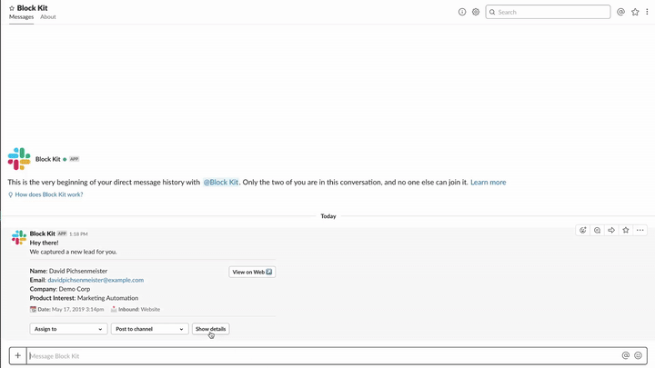

# Blueprint: Details View in Thread

  
*Details in Thread*

🎥 [High Resolution screencast](details-thread.mp4)

### Examples

* Providing a more detailed view for a notification

## Required features

* [Bot User](https://api.slack.com/bot-users)
* [Interactive Components](https://api.slack.com/interactive-messages)

## Required scopes

* [`bot`](https://api.slack.com/scopes/bot)

## Implementation overview

### 1. Message notification

* [payload.json](payload-message.json)
* [Open in Block Kit Builder](https://api.slack.com/tools/block-kit-builder?blocks=%5B%7B%22type%22%3A%22section%22%2C%22text%22%3A%7B%22type%22%3A%22mrkdwn%22%2C%22text%22%3A%22*Hey%20there!*%5CnWe%20captured%20a%20new%20lead%20for%20you.%22%7D%7D%2C%7B%22type%22%3A%22divider%22%7D%2C%7B%22type%22%3A%22section%22%2C%22text%22%3A%7B%22type%22%3A%22mrkdwn%22%2C%22text%22%3A%22*Name*%3A%20David%20Pichsenmeister%5Cn*Email*%3A%20%3Cfakelink.toUser.com%7Cdavidpichsenmeister%40example.com%3E%5Cn*Company*%3A%20Demo%20Corp%5Cn*Product%20Interest*%3A%20Marketing%20Automation%22%7D%2C%22accessory%22%3A%7B%22type%22%3A%22button%22%2C%22text%22%3A%7B%22type%22%3A%22plain_text%22%2C%22text%22%3A%22View%20on%20Web%20%3Aarrow_upper_right%3A%22%2C%22emoji%22%3Atrue%7D%2C%22value%22%3A%22click_me_123%22%7D%7D%2C%7B%22type%22%3A%22context%22%2C%22elements%22%3A%5B%7B%22type%22%3A%22mrkdwn%22%2C%22text%22%3A%22%3Acalendar%3A%20*Date%3A*%20May%2017%2C%202019%203%3A14pm%22%7D%2C%7B%22type%22%3A%22mrkdwn%22%2C%22text%22%3A%22%3Aenvelope_with_arrow%3A%20*Inbound%3A*%20Website%22%7D%5D%7D%2C%7B%22type%22%3A%22divider%22%7D%2C%7B%22type%22%3A%22actions%22%2C%22elements%22%3A%5B%7B%22type%22%3A%22users_select%22%2C%22placeholder%22%3A%7B%22type%22%3A%22plain_text%22%2C%22text%22%3A%22Assign%20to%22%2C%22emoji%22%3Atrue%7D%7D%2C%7B%22type%22%3A%22channels_select%22%2C%22placeholder%22%3A%7B%22type%22%3A%22plain_text%22%2C%22text%22%3A%22Post%20to%20channel%22%2C%22emoji%22%3Atrue%7D%7D%2C%7B%22type%22%3A%22button%22%2C%22text%22%3A%7B%22type%22%3A%22plain_text%22%2C%22text%22%3A%22Show%20details%22%2C%22emoji%22%3Atrue%7D%2C%22value%22%3A%22show_details%22%7D%5D%7D%5D)

#### Methods

* [`chat.postMessage`](https://api.slack.com/methods/chat.postMessage)

### 2. Thread details message

* [payload.json](payload-details.json)
* [Open in Block Kit Builder](https://api.slack.com/tools/block-kit-builder?blocks=%5B%7B%22type%22%3A%22section%22%2C%22text%22%3A%7B%22type%22%3A%22mrkdwn%22%2C%22text%22%3A%22*What%27s%20your%20company%27s%20website%3F*%5Cn%3Cfakelink.toUser.com%7Cdemo-corp.com%3E%5Cn%5Cn*How%20many%20people%20are%20employed%20at%20your%20company%3F*%5Cn1500-2000%5Cn%5Cn*Which%20tools%20are%20you%20currently%20using%3F*%5CnSalesforce%2C%20Hubspot%5Cn%5Cn*Are%20you%20interested%20in%20a%20demo%3F*%5CnYes%22%7D%7D%5D)

#### Methods

* [`chat.postMessage`](https://api.slack.com/methods/chat.postMessage)

