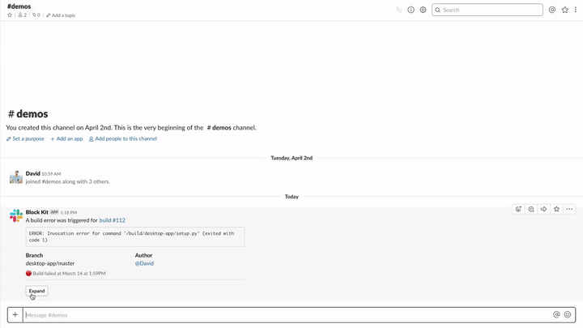

# Expand & Collapse

  
*Expand & Collapse*

🎥 [High Resolution screencast](expand-collapse.mp4)

### Examples

* Simple expand & collapse functionality by updating the message

## Required features

* [Bot User](https://api.slack.com/bot-users)
* [Interactive Components](https://api.slack.com/interactive-messages)

## Required scopes

* [`bot`](https://api.slack.com/scopes/bot)

## Implementation overview

### 1. Post message to channel

* [payload.json](payload-collapse.json)
* [Open in Block Kit Builder](https://api.slack.com/tools/block-kit-builder?blocks=%5B%7B%22type%22%3A%22section%22%2C%22text%22%3A%7B%22type%22%3A%22mrkdwn%22%2C%22text%22%3A%22A%20build%20error%20was%20triggered%20for%20%3Cfakelink.toUrl.com%7Cbuild%20%23112%3E%5Cn%60%60%60ERROR%3A%20Invocation%20error%20for%20command%20%27%2Fbuild%2Fdesktop-app%2Fsetup.py%27%20(exited%20with%20code%201)%60%60%60%22%7D%2C%22fields%22%3A%5B%7B%22type%22%3A%22mrkdwn%22%2C%22text%22%3A%22*Branch*%5Cndesktop-app%2Fmaster%22%7D%2C%7B%22type%22%3A%22mrkdwn%22%2C%22text%22%3A%22*Author*%5Cn%3Cfakelink.toUser.com%7C%40David%3E%22%7D%5D%7D%2C%7B%22type%22%3A%22context%22%2C%22elements%22%3A%5B%7B%22type%22%3A%22mrkdwn%22%2C%22text%22%3A%22%3Ared_circle%3A%20Build%20failed%20at%20March%2014%20at%201%3A59PM%22%7D%5D%7D%2C%7B%22type%22%3A%22divider%22%7D%2C%7B%22type%22%3A%22actions%22%2C%22elements%22%3A%5B%7B%22type%22%3A%22button%22%2C%22text%22%3A%7B%22type%22%3A%22plain_text%22%2C%22emoji%22%3Atrue%2C%22text%22%3A%22Expand%22%7D%2C%22value%22%3A%22expand%22%7D%5D%7D%5D)

#### Methods

* [`chat.postMessage`](https://api.slack.com/methods/chat.postMessage)

### 2. Expand message via update

* [payload.json](payload-expand.json)
* [Open in Block Kit Builder](https://api.slack.com/tools/block-kit-builder?blocks=%5B%7B%22type%22%3A%22section%22%2C%22text%22%3A%7B%22type%22%3A%22mrkdwn%22%2C%22text%22%3A%22A%20build%20error%20was%20triggered%20for%20%3Cfakelink.toUrl.com%7Cbuild%20%23112%3E%5Cn%60%60%60ERROR%3A%20Invocation%20error%20for%20command%20%27%2Fbuild%2Fdesktop-app%2Fsetup.py%27%20(exited%20with%20code%201)%60%60%60%22%7D%2C%22fields%22%3A%5B%7B%22type%22%3A%22mrkdwn%22%2C%22text%22%3A%22*Branch*%5Cndesktop-app%2Fmaster%22%7D%2C%7B%22type%22%3A%22mrkdwn%22%2C%22text%22%3A%22*Author*%5Cn%3Cfakelink.toUser.com%7C%40David%3E%22%7D%2C%7B%22type%22%3A%22mrkdwn%22%2C%22text%22%3A%22*Version*%5Cn3.14.15%22%7D%2C%7B%22type%22%3A%22mrkdwn%22%2C%22text%22%3A%22*Commit*%5Cn%3Cfakelink.toUrl.com%7Ccedbadc8550%3E%22%7D%5D%7D%2C%7B%22type%22%3A%22section%22%2C%22text%22%3A%7B%22type%22%3A%22mrkdwn%22%2C%22text%22%3A%22*Stack%20trace*%5Cn%60%60%60During%20handling%20of%20the%20above%20exception%2C%20another%20exception%20occurred%3A%5Cn%5CnTraceback%20(most%20recent%20call%20last)%3A%5CnFile%20%27%3Cstring%3E%27%2C%20line%201%2C%20in%20%3Cmodule%3E%5CnFile%20%27%2Ftmp%2Fpip-install-w9661i00%2Fpycares%2Fsetup.py%27%2C%20line%2045%2C%20in%20%3Cmodule%3E%5Cnzip_safe%20%20%20%20%20%20%20%20%20%3D%20False%5CnFile%20%27%2Fusr%2Flocal%2Flib%2Fpython3.7%2Fsite-packages%2Fsetuptools%2F__init__.py%27%2C%20line%20144%2C%20in%20setup%5Cn_install_setup_requires(attrs)%5CnFile%20%27%2Fusr%2Flocal%2Flib%2Fpython3.7%2Fsite-packages%2Fsetuptools%2F__init__.py%27%2C%20line%20139%2C%20in%20_install_setup_requires%5Cndist.fetch_build_eggs(dist.setup_requires)%5CnFile%20%27%2Fusr%2Flocal%2Flib%2Fpython3.7%2Fsite-packages%2Fsetuptools%2Fdist.py%27%2C%20line%20717%2C%20in%20fetch_build_eggs%5Cnreplace_conflicting%3DTrue%2C%5CnFile%20%27%2Fusr%2Flocal%2Flib%2Fpython3.7%2Fsite-packages%2Fpkg_resources%2F__init__.py%27%2C%20line%20782%2C%20in%20resolve%5Cnreplace_conflicting%3Dreplace_conflicting%5CnFile%20%27%2Fusr%2Flocal%2Flib%2Fpython3.7%2Fsite-packages%2Fpkg_resources%2F__init__.py%27%2C%20line%201065%2C%20in%20best_match%5Cnreturn%20self.obtain(req%2C%20installer)%5Cndistutils.errors.DistutilsError%3A%20Setup%20script%20exited%20with%20error%3A%20command%20%27gcc%27%20failed%20with%20exit%20status%201%5Cn----------------------------------------%5Cn%5CnERROR%3A%20Command%20%27python%20setup.py%20egg_info%27%20failed%20with%20error%20code%201%20in%20%2Ftmp%2Fpip-install-w9661i00%2Fpycares%2F%60%60%60%22%7D%7D%2C%7B%22type%22%3A%22context%22%2C%22elements%22%3A%5B%7B%22type%22%3A%22mrkdwn%22%2C%22text%22%3A%22%3Ared_circle%3A%20Build%20failed%20at%20March%2014%20at%201%3A59PM%22%7D%5D%7D%2C%7B%22type%22%3A%22divider%22%7D%2C%7B%22type%22%3A%22actions%22%2C%22elements%22%3A%5B%7B%22type%22%3A%22button%22%2C%22text%22%3A%7B%22type%22%3A%22plain_text%22%2C%22emoji%22%3Atrue%2C%22text%22%3A%22Collapse%22%7D%2C%22value%22%3A%22collapse%22%7D%5D%7D%5D)

#### Methods

* [`chat.update`](https://api.slack.com/methods/chat.update)

