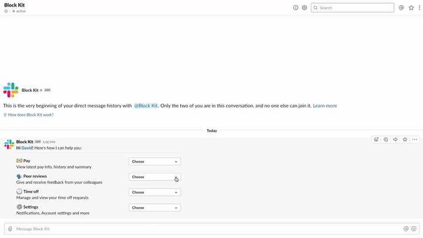

# Peer review

  
*Peer review*

🎥 [High Resolution screencast](hr-review.mp4)

### Examples

* Peer review your coworkers
* Give feedback

## Required features

* [Bot User](https://api.slack.com/bot-users)
* [Interactive Components](https://api.slack.com/interactive-messages)

## Required scopes

* [`bot`](https://api.slack.com/scopes/bot)

## Implementation overview

### 1. Provide an entry point to give feedback in e.g. a help message

* [payload.json](payload-help.json)
* [Open in Block Kit Builder](https://api.slack.com/tools/block-kit-builder?blocks=%5B%7B%22type%22%3A%22section%22%2C%22text%22%3A%7B%22type%22%3A%22mrkdwn%22%2C%22text%22%3A%22*Hi%20%3Cfakelink.toUser.com%7CDavid%3E!*%20Here%27s%20how%20I%20can%20help%20you%3A%22%7D%7D%2C%7B%22type%22%3A%22divider%22%7D%2C%7B%22type%22%3A%22section%22%2C%22text%22%3A%7B%22type%22%3A%22mrkdwn%22%2C%22text%22%3A%22%3Adollar%3A%20*Pay*%5CnView%20latest%20pay%20info%2C%20history%20and%20summary%22%7D%2C%22accessory%22%3A%7B%22type%22%3A%22static_select%22%2C%22placeholder%22%3A%7B%22type%22%3A%22plain_text%22%2C%22text%22%3A%22Choose%22%2C%22emoji%22%3Atrue%7D%2C%22options%22%3A%5B%7B%22text%22%3A%7B%22type%22%3A%22plain_text%22%2C%22text%22%3A%22Latest%20Pay%22%2C%22emoji%22%3Atrue%7D%2C%22value%22%3A%22pay%22%7D%2C%7B%22text%22%3A%7B%22type%22%3A%22plain_text%22%2C%22text%22%3A%22Summary%22%2C%22emoji%22%3Atrue%7D%2C%22value%22%3A%22value-1%22%7D%2C%7B%22text%22%3A%7B%22type%22%3A%22plain_text%22%2C%22text%22%3A%22Pay%20History%22%2C%22emoji%22%3Atrue%7D%2C%22value%22%3A%22value-1%22%7D%5D%7D%7D%2C%7B%22type%22%3A%22section%22%2C%22text%22%3A%7B%22type%22%3A%22mrkdwn%22%2C%22text%22%3A%22%3Aspeaking_head_in_silhouette%3A%20*Peer%20reviews*%5CnGive%20and%20receive%20feedback%20from%20your%20colleagues%22%7D%2C%22accessory%22%3A%7B%22type%22%3A%22static_select%22%2C%22placeholder%22%3A%7B%22type%22%3A%22plain_text%22%2C%22text%22%3A%22Choose%22%2C%22emoji%22%3Atrue%7D%2C%22options%22%3A%5B%7B%22text%22%3A%7B%22type%22%3A%22plain_text%22%2C%22text%22%3A%22Give%20feedback%22%2C%22emoji%22%3Atrue%7D%2C%22value%22%3A%22give_feedback%22%7D%2C%7B%22text%22%3A%7B%22type%22%3A%22plain_text%22%2C%22text%22%3A%22Request%20feedback%22%2C%22emoji%22%3Atrue%7D%2C%22value%22%3A%22value-1%22%7D%2C%7B%22text%22%3A%7B%22type%22%3A%22plain_text%22%2C%22text%22%3A%22Your%20reviews%22%2C%22emoji%22%3Atrue%7D%2C%22value%22%3A%22value-1%22%7D%5D%7D%7D%2C%7B%22type%22%3A%22section%22%2C%22text%22%3A%7B%22type%22%3A%22mrkdwn%22%2C%22text%22%3A%22%3Aclock1%3A%20*Time%20off*%5CnManage%20and%20view%20your%20time%20off%20requests%22%7D%2C%22accessory%22%3A%7B%22type%22%3A%22static_select%22%2C%22placeholder%22%3A%7B%22type%22%3A%22plain_text%22%2C%22text%22%3A%22Choose%22%2C%22emoji%22%3Atrue%7D%2C%22options%22%3A%5B%7B%22text%22%3A%7B%22type%22%3A%22plain_text%22%2C%22text%22%3A%22Request%20time%20off%22%2C%22emoji%22%3Atrue%7D%2C%22value%22%3A%22pay%22%7D%2C%7B%22text%22%3A%7B%22type%22%3A%22plain_text%22%2C%22text%22%3A%22See%20requests%22%2C%22emoji%22%3Atrue%7D%2C%22value%22%3A%22value-1%22%7D%2C%7B%22text%22%3A%7B%22type%22%3A%22plain_text%22%2C%22text%22%3A%22Your%20reviews%22%2C%22emoji%22%3Atrue%7D%2C%22value%22%3A%22value-1%22%7D%5D%7D%7D%2C%7B%22type%22%3A%22section%22%2C%22text%22%3A%7B%22type%22%3A%22mrkdwn%22%2C%22text%22%3A%22%3Agear%3A%20*Settings*%5CnNotifications%2C%20Account%20settings%20and%20more%22%7D%2C%22accessory%22%3A%7B%22type%22%3A%22static_select%22%2C%22placeholder%22%3A%7B%22type%22%3A%22plain_text%22%2C%22text%22%3A%22Choose%22%2C%22emoji%22%3Atrue%7D%2C%22options%22%3A%5B%7B%22text%22%3A%7B%22type%22%3A%22plain_text%22%2C%22text%22%3A%22Notifications%22%2C%22emoji%22%3Atrue%7D%2C%22value%22%3A%22value-0%22%7D%2C%7B%22text%22%3A%7B%22type%22%3A%22plain_text%22%2C%22text%22%3A%22Choice%202%22%2C%22emoji%22%3Atrue%7D%2C%22value%22%3A%22value-1%22%7D%5D%7D%7D%5D)

#### Methods

* [`chat.postMessage`](https://api.slack.com/methods/chat.postMessage)

### 2. Open modal to collect feedback

* [payload.json](payload-modal.json)

#### Methods

* [`views.open`](https://api.slack.com/methods/views.open)

### 3. Post confirmation back to App DM

* [payload.json](payload-confirmation.json)
* [Open in Block Kit Builder](https://api.slack.com/tools/block-kit-builder?blocks=%5B%7B%22type%22%3A%22section%22%2C%22text%22%3A%7B%22type%22%3A%22mrkdwn%22%2C%22text%22%3A%22%3Amailbox_with_mail%3A%20*Your%20feedback%20has%20been%20sent%20to%20%3Cfakelink.toUser.com%7C%40John%3E%20and%20his%20manager%20%3Cfakelink.toUser.com%7C%40Ally%3E.*%22%7D%7D%2C%7B%22type%22%3A%22divider%22%7D%2C%7B%22type%22%3A%22section%22%2C%22text%22%3A%7B%22type%22%3A%22mrkdwn%22%2C%22text%22%3A%22%3E%3E%3E%20One%20of%20your%20most%20impactful%20moments%20were%20the%20insights%20you%20gleaned%20based%20on%20Project%20X.%20It%20showed%20the%20power%20of%20user%20testing%20in%20shaping%20a%20feature%20roadmap%20and%20increases%20the%20likelihood%20that%20we%20satisfy%20and%20delight%20our%20users.%20I%27d%20love%20to%20see%20you%20do%20more%20of%20this.%22%7D%2C%22accessory%22%3A%7B%22type%22%3A%22image%22%2C%22image_url%22%3A%22https%3A%2F%2Fstatic.thenounproject.com%2Fpng%2F347639-200.png%22%2C%22alt_text%22%3A%22palm%20tree%22%7D%7D%5D)

#### Methods

* [`chat.postMessage`](https://api.slack.com/methods/chat.postMessage)
