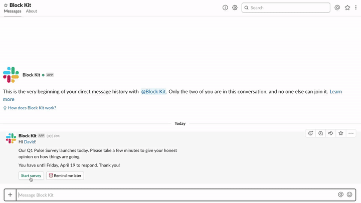

# HR Culture survey

  
*HR culture survey*

🎥 [High Resolution screencast](hr-survey.mp4)

### Example

Performing a culture survey in Slack

## Required features

* [Bot User](https://api.slack.com/bot-users)
* [Interactive Components](https://api.slack.com/interactive-messages)

## Required scopes

* [`bot`](https://api.slack.com/scopes/bot)

## Implementation overview

### 1. Start survey

* [payload.json](payload-start.json)
* [Open in Block Kit Builder](https://api.slack.com/tools/block-kit-builder?blocks=%5B%0A%20%20%7B%0A%20%20%20%20%22type%22%3A%20%22section%22%2C%0A%20%20%20%20%22text%22%3A%20%7B%0A%20%20%20%20%20%20%22type%22%3A%20%22mrkdwn%22%2C%0A%20%20%20%20%20%20%22text%22%3A%20%22Hi%20%3CfakeLink.toUser.com%7CDavid%3E!%5Cn%5CnOur%20Q1%20Pulse%20Survey%20launches%20today.%20Please%20take%20a%20few%20minutes%20to%20give%20your%20honest%20opinion%20on%20how%20things%20are%20going.%5Cn%5CnYou%20have%20until%20Friday%2C%20April%2019%20to%20respond.%20Thank%20you!%22%0A%20%20%20%20%7D%0A%20%20%7D%2C%0A%20%20%7B%0A%20%20%20%20%22type%22%3A%20%22actions%22%2C%0A%20%20%20%20%22elements%22%3A%20%5B%0A%20%20%20%20%20%20%7B%0A%20%20%20%20%20%20%20%20%22type%22%3A%20%22button%22%2C%0A%20%20%20%20%20%20%20%20%22text%22%3A%20%7B%0A%20%20%20%20%20%20%20%20%20%20%22type%22%3A%20%22plain_text%22%2C%0A%20%20%20%20%20%20%20%20%20%20%22text%22%3A%20%22Start%20survey%22%2C%0A%20%20%20%20%20%20%20%20%20%20%22emoji%22%3A%20true%0A%20%20%20%20%20%20%20%20%7D%2C%0A%20%20%20%20%20%20%20%20%22style%22%3A%20%22primary%22%2C%0A%20%20%20%20%20%20%20%20%22value%22%3A%20%22start%22%0A%20%20%20%20%20%20%7D%2C%0A%20%20%20%20%20%20%7B%0A%20%20%20%20%20%20%20%20%22type%22%3A%20%22button%22%2C%0A%20%20%20%20%20%20%20%20%22text%22%3A%20%7B%0A%20%20%20%20%20%20%20%20%20%20%22type%22%3A%20%22plain_text%22%2C%0A%20%20%20%20%20%20%20%20%20%20%22text%22%3A%20%22%3Aalarm_clock%3A%20Remind%20me%20later%22%2C%0A%20%20%20%20%20%20%20%20%20%20%22emoji%22%3A%20true%0A%20%20%20%20%20%20%20%20%7D%2C%0A%20%20%20%20%20%20%20%20%22value%22%3A%20%22remind%22%0A%20%20%20%20%20%20%7D%0A%20%20%20%20%5D%0A%20%20%7D%0A%5D)

#### Methods

* [`chat.postMessage`](https://api.slack.com/methods/chat.postMessage)

### 2. Question

* [payload.json](payload-question.json)
* [Open in Block Kit Builder](https://api.slack.com/tools/block-kit-builder?blocks=%5B%0A%20%20%20%20%20%20%20%20%7B%0A%20%20%20%20%20%20%20%20%20%20%22type%22%3A%20%22section%22%2C%0A%20%20%20%20%20%20%20%20%20%20%22text%22%3A%20%7B%0A%20%20%20%20%20%20%20%20%20%20%20%20%22type%22%3A%20%22mrkdwn%22%2C%0A%20%20%20%20%20%20%20%20%20%20%20%20%22text%22%3A%20%22*Question%201*%22%0A%20%20%20%20%20%20%20%20%20%20%7D%2C%0A%20%20%20%20%20%20%20%20%20%20%22accessory%22%3A%20%7B%0A%20%20%20%20%20%20%20%20%20%20%20%20%22type%22%3A%20%22overflow%22%2C%0A%20%20%20%20%20%20%20%20%20%20%20%20%22options%22%3A%20%5B%0A%20%20%20%20%20%20%20%20%20%20%20%20%20%20%7B%0A%20%20%20%20%20%20%20%20%20%20%20%20%20%20%20%20%22text%22%3A%20%7B%0A%20%20%20%20%20%20%20%20%20%20%20%20%20%20%20%20%20%20%22type%22%3A%20%22plain_text%22%2C%0A%20%20%20%20%20%20%20%20%20%20%20%20%20%20%20%20%20%20%22text%22%3A%20%22%3Aback%3A%20Previous%22%2C%0A%20%20%20%20%20%20%20%20%20%20%20%20%20%20%20%20%20%20%22emoji%22%3A%20true%0A%20%20%20%20%20%20%20%20%20%20%20%20%20%20%20%20%7D%2C%0A%20%20%20%20%20%20%20%20%20%20%20%20%20%20%20%20%22value%22%3A%20%22previous%22%0A%20%20%20%20%20%20%20%20%20%20%20%20%20%20%7D%2C%0A%20%20%20%20%20%20%20%20%20%20%20%20%20%20%7B%0A%20%20%20%20%20%20%20%20%20%20%20%20%20%20%20%20%22text%22%3A%20%7B%0A%20%20%20%20%20%20%20%20%20%20%20%20%20%20%20%20%20%20%22type%22%3A%20%22plain_text%22%2C%0A%20%20%20%20%20%20%20%20%20%20%20%20%20%20%20%20%20%20%22text%22%3A%20%22%3Ax%3A%20Cancel%22%2C%0A%20%20%20%20%20%20%20%20%20%20%20%20%20%20%20%20%20%20%22emoji%22%3A%20true%0A%20%20%20%20%20%20%20%20%20%20%20%20%20%20%20%20%7D%2C%0A%20%20%20%20%20%20%20%20%20%20%20%20%20%20%20%20%22value%22%3A%20%22cancel%22%0A%20%20%20%20%20%20%20%20%20%20%20%20%20%20%7D%0A%20%20%20%20%20%20%20%20%20%20%20%20%5D%0A%20%20%20%20%20%20%20%20%20%20%7D%0A%20%20%20%20%20%20%20%20%7D%2C%0A%20%20%20%20%20%20%20%20%7B%0A%20%20%20%20%20%20%20%20%20%20%22type%22%3A%20%22divider%22%0A%20%20%20%20%20%20%20%20%7D%2C%0A%20%20%20%20%20%20%20%20%7B%0A%20%20%20%20%20%20%20%20%20%20%22type%22%3A%20%22section%22%2C%0A%20%20%20%20%20%20%20%20%20%20%22text%22%3A%20%7B%0A%20%20%20%20%20%20%20%20%20%20%20%20%22type%22%3A%20%22mrkdwn%22%2C%0A%20%20%20%20%20%20%20%20%20%20%20%20%22text%22%3A%20%22This%20job%20is%20a%20good%20fit%20for%20a%20person%20like%20me.%22%0A%20%20%20%20%20%20%20%20%20%20%7D%0A%20%20%20%20%20%20%20%20%7D%2C%0A%20%20%20%20%20%20%20%20%7B%0A%20%20%20%20%20%20%20%20%20%20%22type%22%3A%20%22actions%22%2C%0A%20%20%20%20%20%20%20%20%20%20%22elements%22%3A%20%5B%0A%20%20%20%20%20%20%20%20%20%20%20%20%7B%0A%20%20%20%20%20%20%20%20%20%20%20%20%20%20%22type%22%3A%20%22button%22%2C%0A%20%20%20%20%20%20%20%20%20%20%20%20%20%20%22text%22%3A%20%7B%0A%20%20%20%20%20%20%20%20%20%20%20%20%20%20%20%20%22type%22%3A%20%22plain_text%22%2C%0A%20%20%20%20%20%20%20%20%20%20%20%20%20%20%20%20%22text%22%3A%20%22Fully%20agree%22%2C%0A%20%20%20%20%20%20%20%20%20%20%20%20%20%20%20%20%22emoji%22%3A%20true%0A%20%20%20%20%20%20%20%20%20%20%20%20%20%20%7D%2C%0A%20%20%20%20%20%20%20%20%20%20%20%20%20%20%22style%22%3A%20%22primary%22%2C%0A%20%20%20%20%20%20%20%20%20%20%20%20%20%20%22value%22%3A%20%225%22%0A%20%20%20%20%20%20%20%20%20%20%20%20%7D%2C%0A%20%20%20%20%20%20%20%20%20%20%20%20%7B%0A%20%20%20%20%20%20%20%20%20%20%20%20%20%20%22type%22%3A%20%22button%22%2C%0A%20%20%20%20%20%20%20%20%20%20%20%20%20%20%22text%22%3A%20%7B%0A%20%20%20%20%20%20%20%20%20%20%20%20%20%20%20%20%22type%22%3A%20%22plain_text%22%2C%0A%20%20%20%20%20%20%20%20%20%20%20%20%20%20%20%20%22text%22%3A%20%22Agree%22%2C%0A%20%20%20%20%20%20%20%20%20%20%20%20%20%20%20%20%22emoji%22%3A%20true%0A%20%20%20%20%20%20%20%20%20%20%20%20%20%20%7D%2C%0A%20%20%20%20%20%20%20%20%20%20%20%20%20%20%22value%22%3A%20%224%22%0A%20%20%20%20%20%20%20%20%20%20%20%20%7D%2C%0A%20%20%20%20%20%20%20%20%20%20%20%20%7B%0A%20%20%20%20%20%20%20%20%20%20%20%20%20%20%22type%22%3A%20%22button%22%2C%0A%20%20%20%20%20%20%20%20%20%20%20%20%20%20%22text%22%3A%20%7B%0A%20%20%20%20%20%20%20%20%20%20%20%20%20%20%20%20%22type%22%3A%20%22plain_text%22%2C%0A%20%20%20%20%20%20%20%20%20%20%20%20%20%20%20%20%22text%22%3A%20%22Neutral%22%2C%0A%20%20%20%20%20%20%20%20%20%20%20%20%20%20%20%20%22emoji%22%3A%20true%0A%20%20%20%20%20%20%20%20%20%20%20%20%20%20%7D%2C%0A%20%20%20%20%20%20%20%20%20%20%20%20%20%20%22value%22%3A%20%223%22%0A%20%20%20%20%20%20%20%20%20%20%20%20%7D%2C%0A%20%20%20%20%20%20%20%20%20%20%20%20%7B%0A%20%20%20%20%20%20%20%20%20%20%20%20%20%20%22type%22%3A%20%22button%22%2C%0A%20%20%20%20%20%20%20%20%20%20%20%20%20%20%22text%22%3A%20%7B%0A%20%20%20%20%20%20%20%20%20%20%20%20%20%20%20%20%22type%22%3A%20%22plain_text%22%2C%0A%20%20%20%20%20%20%20%20%20%20%20%20%20%20%20%20%22text%22%3A%20%22Disagree%22%2C%0A%20%20%20%20%20%20%20%20%20%20%20%20%20%20%20%20%22emoji%22%3A%20true%0A%20%20%20%20%20%20%20%20%20%20%20%20%20%20%7D%2C%0A%20%20%20%20%20%20%20%20%20%20%20%20%20%20%22value%22%3A%20%222%22%0A%20%20%20%20%20%20%20%20%20%20%20%20%7D%2C%0A%20%20%20%20%20%20%20%20%20%20%20%20%7B%0A%20%20%20%20%20%20%20%20%20%20%20%20%20%20%22type%22%3A%20%22button%22%2C%0A%20%20%20%20%20%20%20%20%20%20%20%20%20%20%22text%22%3A%20%7B%0A%20%20%20%20%20%20%20%20%20%20%20%20%20%20%20%20%22type%22%3A%20%22plain_text%22%2C%0A%20%20%20%20%20%20%20%20%20%20%20%20%20%20%20%20%22text%22%3A%20%22Fully%20disagree%22%2C%0A%20%20%20%20%20%20%20%20%20%20%20%20%20%20%20%20%22emoji%22%3A%20true%0A%20%20%20%20%20%20%20%20%20%20%20%20%20%20%7D%2C%0A%20%20%20%20%20%20%20%20%20%20%20%20%20%20%22style%22%3A%20%22danger%22%2C%0A%20%20%20%20%20%20%20%20%20%20%20%20%20%20%22value%22%3A%20%221%22%0A%20%20%20%20%20%20%20%20%20%20%20%20%7D%0A%20%20%20%20%20%20%20%20%20%20%5D%0A%20%20%20%20%20%20%20%20%7D%2C%0A%20%20%20%20%20%20%20%20%7B%0A%20%20%20%20%20%20%20%20%20%20%22type%22%3A%20%22divider%22%0A%20%20%20%20%20%20%20%20%7D%2C%0A%20%20%20%20%20%20%20%20%7B%0A%20%20%20%20%20%20%20%20%20%20%22type%22%3A%20%22context%22%2C%0A%20%20%20%20%20%20%20%20%20%20%22elements%22%3A%20%5B%0A%20%20%20%20%20%20%20%20%20%20%20%20%7B%0A%20%20%20%20%20%20%20%20%20%20%20%20%20%20%22type%22%3A%20%22mrkdwn%22%2C%0A%20%20%20%20%20%20%20%20%20%20%20%20%20%20%22text%22%3A%20%22Question%201%20of%203%22%0A%20%20%20%20%20%20%20%20%20%20%20%20%7D%0A%20%20%20%20%20%20%20%20%20%20%5D%0A%20%20%20%20%20%20%20%20%7D%0A%20%20%20%20%20%20%5D)

#### Methods

* [`chat.update`](https://api.slack.com/methods/chat.update)

### 3. Review submission

* [payload.json](payload-review.json)
* [Open in Block Kit Builder](https://api.slack.com/tools/block-kit-builder?blocks=%5B%7B%22type%22%3A%22section%22%2C%22text%22%3A%7B%22type%22%3A%22mrkdwn%22%2C%22text%22%3A%22Here%20are%20your%20answers%2C%20%3CfakeLink.toUser.com%7CDavid%3E%3A%22%7D%7D%2C%7B%22type%22%3A%22divider%22%7D%2C%7B%22type%22%3A%22section%22%2C%22text%22%3A%7B%22type%22%3A%22mrkdwn%22%2C%22text%22%3A%22*Question%201*%5CnThis%20job%20is%20a%20good%20fit%20for%20a%20person%20like%20me.%22%7D%2C%22accessory%22%3A%7B%22type%22%3A%22static_select%22%2C%22placeholder%22%3A%7B%22type%22%3A%22plain_text%22%2C%22text%22%3A%22Select%20answer%22%2C%22emoji%22%3Atrue%7D%2C%22options%22%3A%5B%7B%22text%22%3A%7B%22type%22%3A%22plain_text%22%2C%22text%22%3A%22Fully%20agree%22%2C%22emoji%22%3Atrue%7D%2C%22value%22%3A%221%3A5%22%7D%2C%7B%22text%22%3A%7B%22type%22%3A%22plain_text%22%2C%22text%22%3A%22Agree%22%2C%22emoji%22%3Atrue%7D%2C%22value%22%3A%221%3A4%22%7D%2C%7B%22text%22%3A%7B%22type%22%3A%22plain_text%22%2C%22text%22%3A%22Neutral%22%2C%22emoji%22%3Atrue%7D%2C%22value%22%3A%221%3A3%22%7D%2C%7B%22text%22%3A%7B%22type%22%3A%22plain_text%22%2C%22text%22%3A%22Disagree%22%2C%22emoji%22%3Atrue%7D%2C%22value%22%3A%221%3A2%22%7D%2C%7B%22text%22%3A%7B%22type%22%3A%22plain_text%22%2C%22text%22%3A%22Fully%20disagree%22%2C%22emoji%22%3Atrue%7D%2C%22value%22%3A%221%3A1%22%7D%5D%2C%22initial_option%22%3A%7B%22text%22%3A%7B%22type%22%3A%22plain_text%22%2C%22text%22%3A%22Fully%20agree%22%2C%22emoji%22%3Atrue%7D%2C%22value%22%3A%221%3A5%22%7D%7D%7D%2C%7B%22type%22%3A%22section%22%2C%22text%22%3A%7B%22type%22%3A%22mrkdwn%22%2C%22text%22%3A%22*Question%202*%5CnThe%20atmosphere%20here%20is%20good.%22%7D%2C%22accessory%22%3A%7B%22type%22%3A%22static_select%22%2C%22placeholder%22%3A%7B%22type%22%3A%22plain_text%22%2C%22text%22%3A%22Select%20answer%22%2C%22emoji%22%3Atrue%7D%2C%22options%22%3A%5B%7B%22text%22%3A%7B%22type%22%3A%22plain_text%22%2C%22text%22%3A%22Fully%20agree%22%2C%22emoji%22%3Atrue%7D%2C%22value%22%3A%222%3A5%22%7D%2C%7B%22text%22%3A%7B%22type%22%3A%22plain_text%22%2C%22text%22%3A%22Agree%22%2C%22emoji%22%3Atrue%7D%2C%22value%22%3A%222%3A4%22%7D%2C%7B%22text%22%3A%7B%22type%22%3A%22plain_text%22%2C%22text%22%3A%22Neutral%22%2C%22emoji%22%3Atrue%7D%2C%22value%22%3A%222%3A3%22%7D%2C%7B%22text%22%3A%7B%22type%22%3A%22plain_text%22%2C%22text%22%3A%22Disagree%22%2C%22emoji%22%3Atrue%7D%2C%22value%22%3A%222%3A2%22%7D%2C%7B%22text%22%3A%7B%22type%22%3A%22plain_text%22%2C%22text%22%3A%22Fully%20disagree%22%2C%22emoji%22%3Atrue%7D%2C%22value%22%3A%222%3A1%22%7D%5D%2C%22initial_option%22%3A%7B%22text%22%3A%7B%22type%22%3A%22plain_text%22%2C%22text%22%3A%22Agree%22%2C%22emoji%22%3Atrue%7D%2C%22value%22%3A%222%3A4%22%7D%7D%7D%2C%7B%22type%22%3A%22section%22%2C%22text%22%3A%7B%22type%22%3A%22mrkdwn%22%2C%22text%22%3A%22*Question%203*%5CnI%20personally%20agree%20with%20the%20organization%27s%20values.%22%7D%2C%22accessory%22%3A%7B%22type%22%3A%22static_select%22%2C%22placeholder%22%3A%7B%22type%22%3A%22plain_text%22%2C%22text%22%3A%22Select%20answer%22%2C%22emoji%22%3Atrue%7D%2C%22options%22%3A%5B%7B%22text%22%3A%7B%22type%22%3A%22plain_text%22%2C%22text%22%3A%22Fully%20agree%22%2C%22emoji%22%3Atrue%7D%2C%22value%22%3A%223%3A5%22%7D%2C%7B%22text%22%3A%7B%22type%22%3A%22plain_text%22%2C%22text%22%3A%22Agree%22%2C%22emoji%22%3Atrue%7D%2C%22value%22%3A%223%3A4%22%7D%2C%7B%22text%22%3A%7B%22type%22%3A%22plain_text%22%2C%22text%22%3A%22Neutral%22%2C%22emoji%22%3Atrue%7D%2C%22value%22%3A%223%3A3%22%7D%2C%7B%22text%22%3A%7B%22type%22%3A%22plain_text%22%2C%22text%22%3A%22Disagree%22%2C%22emoji%22%3Atrue%7D%2C%22value%22%3A%223%3A2%22%7D%2C%7B%22text%22%3A%7B%22type%22%3A%22plain_text%22%2C%22text%22%3A%22Fully%20disagree%22%2C%22emoji%22%3Atrue%7D%2C%22value%22%3A%223%3A1%22%7D%5D%2C%22initial_option%22%3A%7B%22text%22%3A%7B%22type%22%3A%22plain_text%22%2C%22text%22%3A%22Agree%22%2C%22emoji%22%3Atrue%7D%2C%22value%22%3A%223%3A4%22%7D%7D%7D%2C%7B%22type%22%3A%22divider%22%7D%2C%7B%22type%22%3A%22actions%22%2C%22elements%22%3A%5B%7B%22type%22%3A%22button%22%2C%22text%22%3A%7B%22type%22%3A%22plain_text%22%2C%22text%22%3A%22Submit%20answers%22%2C%22emoji%22%3Atrue%7D%2C%22style%22%3A%22primary%22%2C%22value%22%3A%22submit%22%7D%2C%7B%22type%22%3A%22button%22%2C%22text%22%3A%7B%22type%22%3A%22plain_text%22%2C%22text%22%3A%22Cancel%22%2C%22emoji%22%3Atrue%7D%2C%22style%22%3A%22danger%22%2C%22value%22%3A%22cancel%22%7D%5D%7D%5D)

#### Methods

* [`chat.update`](https://api.slack.com/methods/chat.update)

### 4. Confirmation

* [payload.json](payload-confirm.json)
* [Open in Block Kit Builder](https://api.slack.com/tools/block-kit-builder?blocks=%5B%0A%20%20%20%20%20%20%20%20%7B%0A%20%20%20%20%20%20%20%20%20%20%22type%22%3A%20%22section%22%2C%0A%20%20%20%20%20%20%20%20%20%20%22text%22%3A%20%7B%0A%20%20%20%20%20%20%20%20%20%20%20%20%22type%22%3A%20%22mrkdwn%22%2C%0A%20%20%20%20%20%20%20%20%20%20%20%20%22text%22%3A%20%22*Thank%20you%2C%20%3CfakeLink.toUser.com%7CDavid%3E!*%22%0A%20%20%20%20%20%20%20%20%20%20%7D%0A%20%20%20%20%20%20%20%20%7D%2C%0A%20%20%20%20%20%20%20%20%7B%0A%20%20%20%20%20%20%20%20%20%20%22type%22%3A%20%22divider%22%0A%20%20%20%20%20%20%20%20%7D%2C%0A%20%20%20%20%20%20%20%20%7B%0A%20%20%20%20%20%20%20%20%20%20%22type%22%3A%20%22section%22%2C%0A%20%20%20%20%20%20%20%20%20%20%22text%22%3A%20%7B%0A%20%20%20%20%20%20%20%20%20%20%20%20%22type%22%3A%20%22mrkdwn%22%2C%0A%20%20%20%20%20%20%20%20%20%20%20%20%22text%22%3A%20%22*Question%201*%5CnThis%20job%20is%20a%20good%20fit%20for%20a%20person%20like%20me.%22%0A%20%20%20%20%20%20%20%20%20%20%7D%0A%20%20%20%20%20%20%20%20%7D%2C%0A%20%20%20%20%20%20%20%20%7B%0A%20%20%20%20%20%20%20%20%20%20%22type%22%3A%20%22context%22%2C%0A%20%20%20%20%20%20%20%20%20%20%22elements%22%3A%20%5B%0A%20%20%20%20%20%20%20%20%20%20%20%20%7B%0A%20%20%20%20%20%20%20%20%20%20%20%20%20%20%22type%22%3A%20%22mrkdwn%22%2C%0A%20%20%20%20%20%20%20%20%20%20%20%20%20%20%22text%22%3A%20%22*Answer%3A*%20Fully%20agree%22%0A%20%20%20%20%20%20%20%20%20%20%20%20%7D%0A%20%20%20%20%20%20%20%20%20%20%5D%0A%20%20%20%20%20%20%20%20%7D%2C%0A%20%20%20%20%20%20%20%20%7B%0A%20%20%20%20%20%20%20%20%20%20%22type%22%3A%20%22section%22%2C%0A%20%20%20%20%20%20%20%20%20%20%22text%22%3A%20%7B%0A%20%20%20%20%20%20%20%20%20%20%20%20%22type%22%3A%20%22mrkdwn%22%2C%0A%20%20%20%20%20%20%20%20%20%20%20%20%22text%22%3A%20%22*Question%202*%5CnThe%20atmosphere%20here%20is%20good.%22%0A%20%20%20%20%20%20%20%20%20%20%7D%0A%20%20%20%20%20%20%20%20%7D%2C%0A%20%20%20%20%20%20%20%20%7B%0A%20%20%20%20%20%20%20%20%20%20%22type%22%3A%20%22context%22%2C%0A%20%20%20%20%20%20%20%20%20%20%22elements%22%3A%20%5B%0A%20%20%20%20%20%20%20%20%20%20%20%20%7B%0A%20%20%20%20%20%20%20%20%20%20%20%20%20%20%22type%22%3A%20%22mrkdwn%22%2C%0A%20%20%20%20%20%20%20%20%20%20%20%20%20%20%22text%22%3A%20%22*Answer%3A*%20Agree%22%0A%20%20%20%20%20%20%20%20%20%20%20%20%7D%0A%20%20%20%20%20%20%20%20%20%20%5D%0A%20%20%20%20%20%20%20%20%7D%2C%0A%20%20%20%20%20%20%20%20%7B%0A%20%20%20%20%20%20%20%20%20%20%22type%22%3A%20%22section%22%2C%0A%20%20%20%20%20%20%20%20%20%20%22text%22%3A%20%7B%0A%20%20%20%20%20%20%20%20%20%20%20%20%22type%22%3A%20%22mrkdwn%22%2C%0A%20%20%20%20%20%20%20%20%20%20%20%20%22text%22%3A%20%22*Question%203*%5CnI%20personally%20agree%20with%20the%20organization%27s%20values.%22%0A%20%20%20%20%20%20%20%20%20%20%7D%0A%20%20%20%20%20%20%20%20%7D%2C%0A%20%20%20%20%20%20%20%20%7B%0A%20%20%20%20%20%20%20%20%20%20%22type%22%3A%20%22context%22%2C%0A%20%20%20%20%20%20%20%20%20%20%22elements%22%3A%20%5B%0A%20%20%20%20%20%20%20%20%20%20%20%20%7B%0A%20%20%20%20%20%20%20%20%20%20%20%20%20%20%22type%22%3A%20%22mrkdwn%22%2C%0A%20%20%20%20%20%20%20%20%20%20%20%20%20%20%22text%22%3A%20%22*Answer%3A*%20Agree%22%0A%20%20%20%20%20%20%20%20%20%20%20%20%7D%0A%20%20%20%20%20%20%20%20%20%20%5D%0A%20%20%20%20%20%20%20%20%7D%2C%0A%20%20%20%20%20%20%20%20%7B%0A%20%20%20%20%20%20%20%20%20%20%22type%22%3A%20%22divider%22%0A%20%20%20%20%20%20%20%20%7D%2C%0A%20%20%20%20%20%20%20%20%7B%0A%20%20%20%20%20%20%20%20%20%20%22type%22%3A%20%22context%22%2C%0A%20%20%20%20%20%20%20%20%20%20%22elements%22%3A%20%5B%0A%20%20%20%20%20%20%20%20%20%20%20%20%7B%0A%20%20%20%20%20%20%20%20%20%20%20%20%20%20%22type%22%3A%20%22mrkdwn%22%2C%0A%20%20%20%20%20%20%20%20%20%20%20%20%20%20%22text%22%3A%20%22%3Awhite_check_mark%3A%20You%20submitted%20this%20survey%20on%2003%2F14%2F2019%20at%2003%3A45pm%22%0A%20%20%20%20%20%20%20%20%20%20%20%20%7D%0A%20%20%20%20%20%20%20%20%20%20%5D%0A%20%20%20%20%20%20%20%20%7D%0A%20%20%20%20%20%20%5D)

#### Methods

* [`chat.update`](https://api.slack.com/methods/chat.update)

