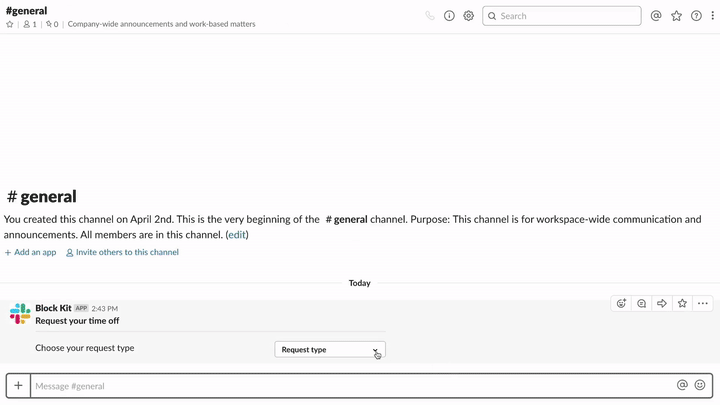

# HR time off request

  
*HR time off request*

🎥 [High Resolution screencast](hr-timeoff.mp4)

### Examples

* Requesting time off in Slack

## Required features

* [Bot User](https://api.slack.com/bot-users)
* [Interactive Components](https://api.slack.com/interactive-messages)

## Required scopes

* [`bot`](https://api.slack.com/scopes/bot)

## Implementation overview

### 1. Start request

* [payload.json](payload-request-step-0.json)
* [Open in Block Kit Builder](https://api.slack.com/tools/block-kit-builder?blocks=%5B%0A%20%20%20%20%7B%0A%20%20%20%20%20%20%22type%22%3A%20%22section%22%2C%0A%20%20%20%20%20%20%22text%22%3A%20%7B%0A%20%20%20%20%20%20%20%20%22type%22%3A%20%22mrkdwn%22%2C%0A%20%20%20%20%20%20%20%20%22text%22%3A%20%22*Request%20your%20time%20off*%22%0A%20%20%20%20%20%20%7D%0A%20%20%20%20%7D%2C%0A%20%20%20%20%7B%0A%20%20%20%20%20%20%22type%22%3A%20%22divider%22%0A%20%20%20%20%7D%2C%0A%20%20%20%20%7B%0A%20%20%20%20%20%20%22type%22%3A%20%22section%22%2C%0A%20%20%20%20%20%20%22text%22%3A%20%7B%0A%20%20%20%20%20%20%20%20%22type%22%3A%20%22mrkdwn%22%2C%0A%20%20%20%20%20%20%20%20%22text%22%3A%20%22Choose%20your%20request%20type%22%0A%20%20%20%20%20%20%7D%2C%0A%20%20%20%20%20%20%22accessory%22%3A%20%7B%0A%20%20%20%20%20%20%20%20%22type%22%3A%20%22static_select%22%2C%0A%20%20%20%20%20%20%20%20%22placeholder%22%3A%20%7B%0A%20%20%20%20%20%20%20%20%20%20%22type%22%3A%20%22plain_text%22%2C%0A%20%20%20%20%20%20%20%20%20%20%22text%22%3A%20%22Request%20type%22%2C%0A%20%20%20%20%20%20%20%20%20%20%22emoji%22%3A%20true%0A%20%20%20%20%20%20%20%20%7D%2C%0A%20%20%20%20%20%20%20%20%22options%22%3A%20%5B%0A%20%20%20%20%20%20%20%20%20%20%7B%0A%20%20%20%20%20%20%20%20%20%20%20%20%22text%22%3A%20%7B%0A%20%20%20%20%20%20%20%20%20%20%20%20%20%20%22type%22%3A%20%22plain_text%22%2C%0A%20%20%20%20%20%20%20%20%20%20%20%20%20%20%22text%22%3A%20%22Paid%20Time%20Off%22%2C%0A%20%20%20%20%20%20%20%20%20%20%20%20%20%20%22emoji%22%3A%20true%0A%20%20%20%20%20%20%20%20%20%20%20%20%7D%2C%0A%20%20%20%20%20%20%20%20%20%20%20%20%22value%22%3A%20%22pto%22%0A%20%20%20%20%20%20%20%20%20%20%7D%2C%0A%20%20%20%20%20%20%20%20%20%20%7B%0A%20%20%20%20%20%20%20%20%20%20%20%20%22text%22%3A%20%7B%0A%20%20%20%20%20%20%20%20%20%20%20%20%20%20%22type%22%3A%20%22plain_text%22%2C%0A%20%20%20%20%20%20%20%20%20%20%20%20%20%20%22text%22%3A%20%22Jury%20Duty%22%2C%0A%20%20%20%20%20%20%20%20%20%20%20%20%20%20%22emoji%22%3A%20true%0A%20%20%20%20%20%20%20%20%20%20%20%20%7D%2C%0A%20%20%20%20%20%20%20%20%20%20%20%20%22value%22%3A%20%22jury_duty%22%0A%20%20%20%20%20%20%20%20%20%20%7D%2C%0A%20%20%20%20%20%20%20%20%20%20%7B%0A%20%20%20%20%20%20%20%20%20%20%20%20%22text%22%3A%20%7B%0A%20%20%20%20%20%20%20%20%20%20%20%20%20%20%22type%22%3A%20%22plain_text%22%2C%0A%20%20%20%20%20%20%20%20%20%20%20%20%20%20%22text%22%3A%20%22Volunteering%20Day%22%2C%0A%20%20%20%20%20%20%20%20%20%20%20%20%20%20%22emoji%22%3A%20true%0A%20%20%20%20%20%20%20%20%20%20%20%20%7D%2C%0A%20%20%20%20%20%20%20%20%20%20%20%20%22value%22%3A%20%22volunteering_day%22%0A%20%20%20%20%20%20%20%20%20%20%7D%0A%20%20%20%20%20%20%20%20%5D%0A%20%20%20%20%20%20%7D%0A%20%20%20%20%7D%0A%20%20%5D)

#### Methods

* [`chat.postMessage`](https://api.slack.com/methods/chat.postMessage)

### 2. Send request

* [payload.json](payload-request-step-1.json)
* [Open in Block Kit Builder](https://api.slack.com/tools/block-kit-builder?blocks=%5B%0A%20%20%20%20%7B%0A%20%20%20%20%20%20%22type%22%3A%20%22section%22%2C%0A%20%20%20%20%20%20%22text%22%3A%20%7B%0A%20%20%20%20%20%20%20%20%22type%22%3A%20%22mrkdwn%22%2C%0A%20%20%20%20%20%20%20%20%22text%22%3A%20%22*Request%20your%20time%20off*%22%0A%20%20%20%20%20%20%7D%0A%20%20%20%20%7D%2C%0A%20%20%20%20%7B%0A%20%20%20%20%20%20%22type%22%3A%20%22divider%22%0A%20%20%20%20%7D%2C%0A%20%20%20%20%7B%0A%20%20%20%20%20%20%22type%22%3A%20%22section%22%2C%0A%20%20%20%20%20%20%22text%22%3A%20%7B%0A%20%20%20%20%20%20%20%20%22type%22%3A%20%22mrkdwn%22%2C%0A%20%20%20%20%20%20%20%20%22text%22%3A%20%22Choose%20your%20request%20type%22%0A%20%20%20%20%20%20%7D%2C%0A%20%20%20%20%20%20%22accessory%22%3A%20%7B%0A%20%20%20%20%20%20%20%20%22type%22%3A%20%22static_select%22%2C%0A%20%20%20%20%20%20%20%20%22placeholder%22%3A%20%7B%0A%20%20%20%20%20%20%20%20%20%20%22type%22%3A%20%22plain_text%22%2C%0A%20%20%20%20%20%20%20%20%20%20%22text%22%3A%20%22Request%20type%22%2C%0A%20%20%20%20%20%20%20%20%20%20%22emoji%22%3A%20true%0A%20%20%20%20%20%20%20%20%7D%2C%0A%20%20%20%20%20%20%20%20%22options%22%3A%20%5B%0A%20%20%20%20%20%20%20%20%20%20%7B%0A%20%20%20%20%20%20%20%20%20%20%20%20%22text%22%3A%20%7B%0A%20%20%20%20%20%20%20%20%20%20%20%20%20%20%22type%22%3A%20%22plain_text%22%2C%0A%20%20%20%20%20%20%20%20%20%20%20%20%20%20%22text%22%3A%20%22Paid%20Time%20Off%22%2C%0A%20%20%20%20%20%20%20%20%20%20%20%20%20%20%22emoji%22%3A%20true%0A%20%20%20%20%20%20%20%20%20%20%20%20%7D%2C%0A%20%20%20%20%20%20%20%20%20%20%20%20%22value%22%3A%20%22pto%22%0A%20%20%20%20%20%20%20%20%20%20%7D%2C%0A%20%20%20%20%20%20%20%20%20%20%7B%0A%20%20%20%20%20%20%20%20%20%20%20%20%22text%22%3A%20%7B%0A%20%20%20%20%20%20%20%20%20%20%20%20%20%20%22type%22%3A%20%22plain_text%22%2C%0A%20%20%20%20%20%20%20%20%20%20%20%20%20%20%22text%22%3A%20%22Jury%20Duty%22%2C%0A%20%20%20%20%20%20%20%20%20%20%20%20%20%20%22emoji%22%3A%20true%0A%20%20%20%20%20%20%20%20%20%20%20%20%7D%2C%0A%20%20%20%20%20%20%20%20%20%20%20%20%22value%22%3A%20%22jury_duty%22%0A%20%20%20%20%20%20%20%20%20%20%7D%2C%0A%20%20%20%20%20%20%20%20%20%20%7B%0A%20%20%20%20%20%20%20%20%20%20%20%20%22text%22%3A%20%7B%0A%20%20%20%20%20%20%20%20%20%20%20%20%20%20%22type%22%3A%20%22plain_text%22%2C%0A%20%20%20%20%20%20%20%20%20%20%20%20%20%20%22text%22%3A%20%22Volunteering%20Day%22%2C%0A%20%20%20%20%20%20%20%20%20%20%20%20%20%20%22emoji%22%3A%20true%0A%20%20%20%20%20%20%20%20%20%20%20%20%7D%2C%0A%20%20%20%20%20%20%20%20%20%20%20%20%22value%22%3A%20%22volunteering_day%22%0A%20%20%20%20%20%20%20%20%20%20%7D%0A%20%20%20%20%20%20%20%20%5D%2C%0A%20%20%20%20%20%20%20%20%22initial_option%22%3A%20%7B%0A%20%20%20%20%20%20%20%20%20%20%22text%22%3A%20%7B%0A%20%20%20%20%20%20%20%20%20%20%20%20%22type%22%3A%20%22plain_text%22%2C%0A%20%20%20%20%20%20%20%20%20%20%20%20%22text%22%3A%20%22Paid%20Time%20Off%22%2C%0A%20%20%20%20%20%20%20%20%20%20%20%20%22emoji%22%3A%20true%0A%20%20%20%20%20%20%20%20%20%20%7D%2C%0A%20%20%20%20%20%20%20%20%20%20%22value%22%3A%20%22pto%22%0A%20%20%20%20%20%20%20%20%7D%0A%20%20%20%20%20%20%7D%0A%20%20%20%20%7D%2C%0A%20%20%20%20%7B%0A%20%20%20%20%20%20%22type%22%3A%20%22section%22%2C%0A%20%20%20%20%20%20%22text%22%3A%20%7B%0A%20%20%20%20%20%20%20%20%22type%22%3A%20%22mrkdwn%22%2C%0A%20%20%20%20%20%20%20%20%22text%22%3A%20%22Select%20*Start%20Date*%22%0A%20%20%20%20%20%20%7D%2C%0A%20%20%20%20%20%20%22accessory%22%3A%20%7B%0A%20%20%20%20%20%20%20%20%22type%22%3A%20%22datepicker%22%2C%0A%20%20%20%20%20%20%20%20%22placeholder%22%3A%20%7B%0A%20%20%20%20%20%20%20%20%20%20%22type%22%3A%20%22plain_text%22%2C%0A%20%20%20%20%20%20%20%20%20%20%22text%22%3A%20%22Select%20date%22%2C%0A%20%20%20%20%20%20%20%20%20%20%22emoji%22%3A%20true%0A%20%20%20%20%20%20%20%20%7D%0A%20%20%20%20%20%20%7D%0A%20%20%20%20%7D%2C%0A%20%20%20%20%7B%0A%20%20%20%20%20%20%22type%22%3A%20%22section%22%2C%0A%20%20%20%20%20%20%22text%22%3A%20%7B%0A%20%20%20%20%20%20%20%20%22type%22%3A%20%22mrkdwn%22%2C%0A%20%20%20%20%20%20%20%20%22text%22%3A%20%22Select%20*End%20Date*%22%0A%20%20%20%20%20%20%7D%2C%0A%20%20%20%20%20%20%22accessory%22%3A%20%7B%0A%20%20%20%20%20%20%20%20%22type%22%3A%20%22datepicker%22%2C%0A%20%20%20%20%20%20%20%20%22placeholder%22%3A%20%7B%0A%20%20%20%20%20%20%20%20%20%20%22type%22%3A%20%22plain_text%22%2C%0A%20%20%20%20%20%20%20%20%20%20%22text%22%3A%20%22Select%20date%22%2C%0A%20%20%20%20%20%20%20%20%20%20%22emoji%22%3A%20true%0A%20%20%20%20%20%20%20%20%7D%0A%20%20%20%20%20%20%7D%0A%20%20%20%20%7D%2C%0A%20%20%20%20%7B%0A%20%20%20%20%20%20%22type%22%3A%20%22actions%22%2C%0A%20%20%20%20%20%20%22elements%22%3A%20%5B%0A%20%20%20%20%20%20%20%20%7B%0A%20%20%20%20%20%20%20%20%20%20%22type%22%3A%20%22button%22%2C%0A%20%20%20%20%20%20%20%20%20%20%22text%22%3A%20%7B%0A%20%20%20%20%20%20%20%20%20%20%20%20%22type%22%3A%20%22plain_text%22%2C%0A%20%20%20%20%20%20%20%20%20%20%20%20%22text%22%3A%20%22Send%20request%22%2C%0A%20%20%20%20%20%20%20%20%20%20%20%20%22emoji%22%3A%20true%0A%20%20%20%20%20%20%20%20%20%20%7D%2C%0A%20%20%20%20%20%20%20%20%20%20%22style%22%3A%20%22primary%22%2C%0A%20%20%20%20%20%20%20%20%20%20%22value%22%3A%20%22submit%22%0A%20%20%20%20%20%20%20%20%7D%2C%0A%20%20%20%20%20%20%20%20%7B%0A%20%20%20%20%20%20%20%20%20%20%22type%22%3A%20%22button%22%2C%0A%20%20%20%20%20%20%20%20%20%20%22text%22%3A%20%7B%0A%20%20%20%20%20%20%20%20%20%20%20%20%22type%22%3A%20%22plain_text%22%2C%0A%20%20%20%20%20%20%20%20%20%20%20%20%22text%22%3A%20%22Cancel%20request%22%2C%0A%20%20%20%20%20%20%20%20%20%20%20%20%22emoji%22%3A%20true%0A%20%20%20%20%20%20%20%20%20%20%7D%2C%0A%20%20%20%20%20%20%20%20%20%20%22value%22%3A%20%22cancel%22%0A%20%20%20%20%20%20%20%20%7D%0A%20%20%20%20%20%20%5D%0A%20%20%20%20%7D%0A%20%20%5D)

#### Methods

* [`chat.update`](https://api.slack.com/methods/chat.update)

### 3. Confirmation

* [payload.json](payload-confirm.json)
* [Open in Block Kit Builder](https://api.slack.com/tools/block-kit-builder?blocks=%5B%0A%20%20%20%20%20%20%20%20%7B%0A%20%20%20%20%20%20%20%20%20%20%22type%22%3A%20%22section%22%2C%0A%20%20%20%20%20%20%20%20%20%20%22text%22%3A%20%7B%0A%20%20%20%20%20%20%20%20%20%20%20%20%22type%22%3A%20%22mrkdwn%22%2C%0A%20%20%20%20%20%20%20%20%20%20%20%20%22text%22%3A%20%22Your%20request%20for%20*Paid%20Time%20Off*%20has%20been%20sent.%22%0A%20%20%20%20%20%20%20%20%20%20%7D%0A%20%20%20%20%20%20%20%20%7D%2C%0A%20%20%20%20%20%20%20%20%7B%0A%20%20%20%20%20%20%20%20%20%20%22type%22%3A%20%22section%22%2C%0A%20%20%20%20%20%20%20%20%20%20%22fields%22%3A%20%5B%0A%20%20%20%20%20%20%20%20%20%20%20%20%7B%0A%20%20%20%20%20%20%20%20%20%20%20%20%20%20%22type%22%3A%20%22mrkdwn%22%2C%0A%20%20%20%20%20%20%20%20%20%20%20%20%20%20%22text%22%3A%20%22*Start%20Date%3A*%5CnApr%2010%2C%202019%22%0A%20%20%20%20%20%20%20%20%20%20%20%20%7D%2C%0A%20%20%20%20%20%20%20%20%20%20%20%20%7B%0A%20%20%20%20%20%20%20%20%20%20%20%20%20%20%22type%22%3A%20%22mrkdwn%22%2C%0A%20%20%20%20%20%20%20%20%20%20%20%20%20%20%22text%22%3A%20%22*End%20Date%3A*%5CnApr%2012%2C%202019%22%0A%20%20%20%20%20%20%20%20%20%20%20%20%7D%0A%20%20%20%20%20%20%20%20%20%20%5D%0A%20%20%20%20%20%20%20%20%7D%0A%20%20%20%20%20%20%5D)

#### Methods

* [`chat.update`](https://api.slack.com/methods/chat.update)

