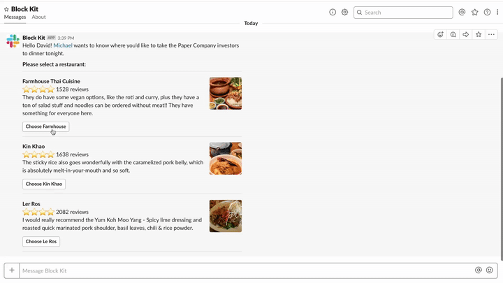

# Private poll in a DM

  
*Private poll in channel*

🎥 [High Resolution screencast](private-poll.mp4)

### Examples

* Sending a private poll to a user in Slack via App DM

## Required features

* [Bot User](https://api.slack.com/bot-users)
* [Interactive Components](https://api.slack.com/interactive-messages)

## Required scopes

* [`bot`](https://api.slack.com/scopes/bot)

## Implementation overview

### 1. Poll

* [payload.json](payload-private-poll.json)
* [Open in Block Kit Builder](https://api.slack.com/tools/block-kit-builder?blocks=%5B%0A%20%20%20%20%20%20%20%20%7B%0A%20%20%20%20%20%20%20%20%20%20%22type%22%3A%20%22section%22%2C%0A%20%20%20%20%20%20%20%20%20%20%22text%22%3A%20%7B%0A%20%20%20%20%20%20%20%20%20%20%20%20%22type%22%3A%20%22mrkdwn%22%2C%0A%20%20%20%20%20%20%20%20%20%20%20%20%22text%22%3A%20%22Hello%20David!%20%3CfakeLink.toUser.com%7CMichael%3E%20wants%20to%20know%20where%20you%27d%20like%20to%20take%20the%20Paper%20Company%20investors%20to%20dinner%20tonight.%5Cn%5Cn%20*Please%20select%20a%20restaurant%3A*%22%0A%20%20%20%20%20%20%20%20%20%20%7D%0A%20%20%20%20%20%20%20%20%7D%2C%0A%20%20%20%20%20%20%20%20%7B%0A%20%20%20%20%20%20%20%20%20%20%22type%22%3A%20%22divider%22%0A%20%20%20%20%20%20%20%20%7D%2C%0A%20%20%20%20%20%20%20%20%7B%0A%20%20%20%20%20%20%20%20%20%20%22type%22%3A%20%22section%22%2C%0A%20%20%20%20%20%20%20%20%20%20%22text%22%3A%20%7B%0A%20%20%20%20%20%20%20%20%20%20%20%20%22type%22%3A%20%22mrkdwn%22%2C%0A%20%20%20%20%20%20%20%20%20%20%20%20%22text%22%3A%20%22*Farmhouse%20Thai%20Cuisine*%5Cn%3Astar%3A%3Astar%3A%3Astar%3A%3Astar%3A%201528%20reviews%5Cn%20They%20do%20have%20some%20vegan%20options%2C%20like%20the%20roti%20and%20curry%2C%20plus%20they%20have%20a%20ton%20of%20salad%20stuff%20and%20noodles%20can%20be%20ordered%20without%20meat!!%20They%20have%20something%20for%20everyone%20here.%22%0A%20%20%20%20%20%20%20%20%20%20%7D%2C%0A%20%20%20%20%20%20%20%20%20%20%22accessory%22%3A%20%7B%0A%20%20%20%20%20%20%20%20%20%20%20%20%22type%22%3A%20%22image%22%2C%0A%20%20%20%20%20%20%20%20%20%20%20%20%22image_url%22%3A%20%22https%3A%2F%2Fs3-media3.fl.yelpcdn.com%2Fbphoto%2Fc7ed05m9lC2EmA3Aruue7A%2Fo.jpg%22%2C%0A%20%20%20%20%20%20%20%20%20%20%20%20%22alt_text%22%3A%20%22alt%20text%20for%20image%22%0A%20%20%20%20%20%20%20%20%20%20%7D%0A%20%20%20%20%20%20%20%20%7D%2C%0A%20%20%20%20%20%20%20%20%20%20%7B%0A%20%20%20%20%20%20%20%20%20%20%22type%22%3A%20%22actions%22%2C%0A%20%20%20%20%20%20%20%20%20%20%22elements%22%3A%20%5B%0A%20%20%20%20%20%20%20%20%20%20%20%20%7B%0A%20%20%20%20%20%20%20%20%20%20%20%20%20%20%22type%22%3A%20%22button%22%2C%0A%20%20%20%20%20%20%20%20%20%20%20%20%20%20%22text%22%3A%20%7B%0A%20%20%20%20%20%20%20%20%20%20%20%20%20%20%20%20%22type%22%3A%20%22plain_text%22%2C%0A%20%20%20%20%20%20%20%20%20%20%20%20%20%20%20%20%22text%22%3A%20%22Choose%20Farmhouse%22%2C%0A%20%20%20%20%20%20%20%20%20%20%20%20%20%20%20%20%22emoji%22%3A%20true%0A%20%20%20%20%20%20%20%20%20%20%20%20%20%20%7D%2C%0A%20%20%20%20%20%20%20%20%20%20%20%20%20%20%22value%22%3A%20%22farmhouse%22%0A%20%20%20%20%20%20%20%20%20%20%20%20%7D%0A%20%20%20%20%20%20%20%20%20%20%5D%0A%20%20%20%20%20%20%20%20%7D%2C%0A%20%20%20%20%20%20%20%20%20%20%7B%0A%20%20%20%20%20%20%20%20%20%20%22type%22%3A%20%22divider%22%0A%20%20%20%20%20%20%20%20%7D%2C%0A%20%20%20%20%20%20%20%20%7B%0A%20%20%20%20%20%20%20%20%20%20%22type%22%3A%20%22section%22%2C%0A%20%20%20%20%20%20%20%20%20%20%22text%22%3A%20%7B%0A%20%20%20%20%20%20%20%20%20%20%20%20%22type%22%3A%20%22mrkdwn%22%2C%0A%20%20%20%20%20%20%20%20%20%20%20%20%22text%22%3A%20%22*Kin%20Khao*%5Cn%3Astar%3A%3Astar%3A%3Astar%3A%3Astar%3A%201638%20reviews%5Cn%20The%20sticky%20rice%20also%20goes%20wonderfully%20with%20the%20caramelized%20pork%20belly%2C%20which%20is%20absolutely%20melt-in-your-mouth%20and%20so%20soft.%22%0A%20%20%20%20%20%20%20%20%20%20%7D%2C%0A%20%20%20%20%20%20%20%20%20%20%22accessory%22%3A%20%7B%0A%20%20%20%20%20%20%20%20%20%20%20%20%22type%22%3A%20%22image%22%2C%0A%20%20%20%20%20%20%20%20%20%20%20%20%22image_url%22%3A%20%22https%3A%2F%2Fs3-media2.fl.yelpcdn.com%2Fbphoto%2Fkorel-1YjNtFtJlMTaC26A%2Fo.jpg%22%2C%0A%20%20%20%20%20%20%20%20%20%20%20%20%22alt_text%22%3A%20%22alt%20text%20for%20image%22%0A%20%20%20%20%20%20%20%20%20%20%7D%0A%20%20%20%20%20%20%20%20%7D%2C%0A%20%20%20%20%20%20%20%20%20%20%7B%0A%20%20%20%20%20%20%20%20%20%20%22type%22%3A%20%22actions%22%2C%0A%20%20%20%20%20%20%20%20%20%20%22elements%22%3A%20%5B%0A%20%20%20%20%20%20%20%20%20%20%20%20%7B%0A%20%20%20%20%20%20%20%20%20%20%20%20%20%20%22type%22%3A%20%22button%22%2C%0A%20%20%20%20%20%20%20%20%20%20%20%20%20%20%22text%22%3A%20%7B%0A%20%20%20%20%20%20%20%20%20%20%20%20%20%20%20%20%22type%22%3A%20%22plain_text%22%2C%0A%20%20%20%20%20%20%20%20%20%20%20%20%20%20%20%20%22text%22%3A%20%22Choose%20Kin%20Khao%22%2C%0A%20%20%20%20%20%20%20%20%20%20%20%20%20%20%20%20%22emoji%22%3A%20true%0A%20%20%20%20%20%20%20%20%20%20%20%20%20%20%7D%2C%0A%20%20%20%20%20%20%20%20%20%20%20%20%20%20%22value%22%3A%20%22kin-khao%22%0A%20%20%20%20%20%20%20%20%20%20%20%20%7D%0A%20%20%20%20%20%20%20%20%20%20%5D%0A%20%20%20%20%20%20%20%20%7D%2C%0A%20%20%20%20%20%20%20%20%20%20%7B%0A%20%20%20%20%20%20%20%20%20%20%22type%22%3A%20%22divider%22%0A%20%20%20%20%20%20%20%20%7D%2C%0A%20%20%20%20%20%20%20%20%7B%0A%20%20%20%20%20%20%20%20%20%20%22type%22%3A%20%22section%22%2C%0A%20%20%20%20%20%20%20%20%20%20%22text%22%3A%20%7B%0A%20%20%20%20%20%20%20%20%20%20%20%20%22type%22%3A%20%22mrkdwn%22%2C%0A%20%20%20%20%20%20%20%20%20%20%20%20%22text%22%3A%20%22*Ler%20Ros*%5Cn%3Astar%3A%3Astar%3A%3Astar%3A%3Astar%3A%202082%20reviews%5Cn%20I%20would%20really%20recommend%20the%20Yum%20Koh%20Moo%20Yang%20-%20Spicy%20lime%20dressing%20and%20roasted%20quick%20marinated%20pork%20shoulder%2C%20basil%20leaves%2C%20chili%20%26%20rice%20powder.%22%0A%20%20%20%20%20%20%20%20%20%20%7D%2C%0A%20%20%20%20%20%20%20%20%20%20%22accessory%22%3A%20%7B%0A%20%20%20%20%20%20%20%20%20%20%20%20%22type%22%3A%20%22image%22%2C%0A%20%20%20%20%20%20%20%20%20%20%20%20%22image_url%22%3A%20%22https%3A%2F%2Fs3-media2.fl.yelpcdn.com%2Fbphoto%2FDawwNigKJ2ckPeDeDM7jAg%2Fo.jpg%22%2C%0A%20%20%20%20%20%20%20%20%20%20%20%20%22alt_text%22%3A%20%22alt%20text%20for%20image%22%0A%20%20%20%20%20%20%20%20%20%20%7D%0A%20%20%20%20%20%20%20%20%7D%2C%0A%20%20%20%20%20%20%20%20%20%20%7B%0A%20%20%20%20%20%20%20%20%20%20%22type%22%3A%20%22actions%22%2C%0A%20%20%20%20%20%20%20%20%20%20%22elements%22%3A%20%5B%0A%20%20%20%20%20%20%20%20%20%20%20%20%7B%0A%20%20%20%20%20%20%20%20%20%20%20%20%20%20%22type%22%3A%20%22button%22%2C%0A%20%20%20%20%20%20%20%20%20%20%20%20%20%20%22text%22%3A%20%7B%0A%20%20%20%20%20%20%20%20%20%20%20%20%20%20%20%20%22type%22%3A%20%22plain_text%22%2C%0A%20%20%20%20%20%20%20%20%20%20%20%20%20%20%20%20%22text%22%3A%20%22Choose%20Le%20Ros%22%2C%0A%20%20%20%20%20%20%20%20%20%20%20%20%20%20%20%20%22emoji%22%3A%20true%0A%20%20%20%20%20%20%20%20%20%20%20%20%20%20%7D%2C%0A%20%20%20%20%20%20%20%20%20%20%20%20%20%20%22value%22%3A%20%22le-ros%22%0A%20%20%20%20%20%20%20%20%20%20%20%20%7D%0A%20%20%20%20%20%20%20%20%20%20%5D%0A%20%20%20%20%20%20%20%20%7D%2C%0A%20%20%20%20%20%20%20%20%7B%0A%20%20%20%20%20%20%20%20%20%20%22type%22%3A%20%22divider%22%0A%20%20%20%20%20%20%20%20%7D%0A%20%20%20%20%20%20%5D)

#### Methods

* [`chat.postMessage`](https://api.slack.com/methods/chat.postMessage)

### 2. Confirmation

* [payload.json](payload-private-poll-confirm.json)
* [Open in Block Kit Builder](https://api.slack.com/tools/block-kit-builder?blocks=%5B%0A%20%20%20%20%20%20%20%20%7B%0A%20%20%20%20%20%20%20%20%20%20%22type%22%3A%20%22section%22%2C%0A%20%20%20%20%20%20%20%20%20%20%22text%22%3A%20%7B%0A%20%20%20%20%20%20%20%20%20%20%20%20%22type%22%3A%20%22mrkdwn%22%2C%0A%20%20%20%20%20%20%20%20%20%20%20%20%22text%22%3A%20%22Hello%20David!%20%3CfakeLink.toUser.com%7CMichael%3E%20wants%20to%20know%20where%20you%27d%20like%20to%20take%20the%20Paper%20Company%20investors%20to%20dinner%20tonight.%5Cn%5Cn%20*Please%20select%20a%20restaurant%3A*%22%0A%20%20%20%20%20%20%20%20%20%20%7D%0A%20%20%20%20%20%20%20%20%7D%2C%0A%20%20%20%20%20%20%20%20%7B%0A%20%20%20%20%20%20%20%20%20%20%22type%22%3A%20%22divider%22%0A%20%20%20%20%20%20%20%20%7D%2C%0A%20%20%20%20%20%20%20%20%7B%0A%20%20%20%20%20%20%20%20%20%20%22type%22%3A%20%22section%22%2C%0A%20%20%20%20%20%20%20%20%20%20%22text%22%3A%20%7B%0A%20%20%20%20%20%20%20%20%20%20%20%20%22type%22%3A%20%22mrkdwn%22%2C%0A%20%20%20%20%20%20%20%20%20%20%20%20%22text%22%3A%20%22*Farmhouse%20Thai%20Cuisine*%5Cn%3Astar%3A%3Astar%3A%3Astar%3A%3Astar%3A%201528%20reviews%5Cn%20They%20do%20have%20some%20vegan%20options%2C%20like%20the%20roti%20and%20curry%2C%20plus%20they%20have%20a%20ton%20of%20salad%20stuff%20and%20noodles%20can%20be%20ordered%20without%20meat!!%20They%20have%20something%20for%20everyone%20here.%22%0A%20%20%20%20%20%20%20%20%20%20%7D%2C%0A%20%20%20%20%20%20%20%20%20%20%22accessory%22%3A%20%7B%0A%20%20%20%20%20%20%20%20%20%20%20%20%22type%22%3A%20%22image%22%2C%0A%20%20%20%20%20%20%20%20%20%20%20%20%22image_url%22%3A%20%22https%3A%2F%2Fs3-media3.fl.yelpcdn.com%2Fbphoto%2Fc7ed05m9lC2EmA3Aruue7A%2Fo.jpg%22%2C%0A%20%20%20%20%20%20%20%20%20%20%20%20%22alt_text%22%3A%20%22alt%20text%20for%20image%22%0A%20%20%20%20%20%20%20%20%20%20%7D%0A%20%20%20%20%20%20%20%20%7D%2C%0A%20%20%20%20%20%20%20%20%7B%0A%20%20%20%20%20%20%20%20%20%20%22type%22%3A%20%22context%22%2C%0A%20%20%20%20%20%20%20%20%20%20%22elements%22%3A%20%5B%0A%20%20%20%20%20%20%20%20%20%20%20%20%7B%0A%20%20%20%20%20%20%20%20%20%20%20%20%20%20%22type%22%3A%20%22plain_text%22%2C%0A%20%20%20%20%20%20%20%20%20%20%20%20%20%20%22text%22%3A%20%22%3Awhite_check_mark%3A%20You%20selected%20this%20restaurant%22%2C%0A%20%20%20%20%20%20%20%20%20%20%20%20%20%20%22emoji%22%3A%20true%0A%20%20%20%20%20%20%20%20%20%20%20%20%7D%0A%20%20%20%20%20%20%20%20%20%20%5D%0A%20%20%20%20%20%20%20%20%7D%2C%0A%20%20%20%20%20%20%20%20%7B%0A%20%20%20%20%20%20%20%20%20%20%22type%22%3A%20%22divider%22%0A%20%20%20%20%20%20%20%20%7D%2C%0A%20%20%20%20%20%20%20%20%7B%0A%20%20%20%20%20%20%20%20%20%20%22type%22%3A%20%22section%22%2C%0A%20%20%20%20%20%20%20%20%20%20%22text%22%3A%20%7B%0A%20%20%20%20%20%20%20%20%20%20%20%20%22type%22%3A%20%22mrkdwn%22%2C%0A%20%20%20%20%20%20%20%20%20%20%20%20%22text%22%3A%20%22*Kin%20Khao*%5Cn%3Astar%3A%3Astar%3A%3Astar%3A%3Astar%3A%201638%20reviews%5Cn%20The%20sticky%20rice%20also%20goes%20wonderfully%20with%20the%20caramelized%20pork%20belly%2C%20which%20is%20absolutely%20melt-in-your-mouth%20and%20so%20soft.%22%0A%20%20%20%20%20%20%20%20%20%20%7D%2C%0A%20%20%20%20%20%20%20%20%20%20%22accessory%22%3A%20%7B%0A%20%20%20%20%20%20%20%20%20%20%20%20%22type%22%3A%20%22image%22%2C%0A%20%20%20%20%20%20%20%20%20%20%20%20%22image_url%22%3A%20%22https%3A%2F%2Fs3-media2.fl.yelpcdn.com%2Fbphoto%2Fkorel-1YjNtFtJlMTaC26A%2Fo.jpg%22%2C%0A%20%20%20%20%20%20%20%20%20%20%20%20%22alt_text%22%3A%20%22alt%20text%20for%20image%22%0A%20%20%20%20%20%20%20%20%20%20%7D%0A%20%20%20%20%20%20%20%20%7D%2C%0A%20%20%20%20%20%20%20%20%7B%0A%20%20%20%20%20%20%20%20%20%20%22type%22%3A%20%22divider%22%0A%20%20%20%20%20%20%20%20%7D%2C%0A%20%20%20%20%20%20%20%20%7B%0A%20%20%20%20%20%20%20%20%20%20%22type%22%3A%20%22section%22%2C%0A%20%20%20%20%20%20%20%20%20%20%22text%22%3A%20%7B%0A%20%20%20%20%20%20%20%20%20%20%20%20%22type%22%3A%20%22mrkdwn%22%2C%0A%20%20%20%20%20%20%20%20%20%20%20%20%22text%22%3A%20%22*Ler%20Ros*%5Cn%3Astar%3A%3Astar%3A%3Astar%3A%3Astar%3A%202082%20reviews%5Cn%20I%20would%20really%20recommend%20the%20Yum%20Koh%20Moo%20Yang%20-%20Spicy%20lime%20dressing%20and%20roasted%20quick%20marinated%20pork%20shoulder%2C%20basil%20leaves%2C%20chili%20%26%20rice%20powder.%22%0A%20%20%20%20%20%20%20%20%20%20%7D%2C%0A%20%20%20%20%20%20%20%20%20%20%22accessory%22%3A%20%7B%0A%20%20%20%20%20%20%20%20%20%20%20%20%22type%22%3A%20%22image%22%2C%0A%20%20%20%20%20%20%20%20%20%20%20%20%22image_url%22%3A%20%22https%3A%2F%2Fs3-media2.fl.yelpcdn.com%2Fbphoto%2FDawwNigKJ2ckPeDeDM7jAg%2Fo.jpg%22%2C%0A%20%20%20%20%20%20%20%20%20%20%20%20%22alt_text%22%3A%20%22alt%20text%20for%20image%22%0A%20%20%20%20%20%20%20%20%20%20%7D%0A%20%20%20%20%20%20%20%20%7D%2C%0A%20%20%20%20%20%20%20%20%7B%0A%20%20%20%20%20%20%20%20%20%20%22type%22%3A%20%22divider%22%0A%20%20%20%20%20%20%20%20%7D%2C%0A%20%20%20%20%20%20%20%20%7B%0A%20%20%20%20%20%20%20%20%20%20%22type%22%3A%20%22actions%22%2C%0A%20%20%20%20%20%20%20%20%20%20%22elements%22%3A%20%5B%0A%20%20%20%20%20%20%20%20%20%20%20%20%7B%0A%20%20%20%20%20%20%20%20%20%20%20%20%20%20%22type%22%3A%20%22button%22%2C%0A%20%20%20%20%20%20%20%20%20%20%20%20%20%20%22text%22%3A%20%7B%0A%20%20%20%20%20%20%20%20%20%20%20%20%20%20%20%20%22type%22%3A%20%22plain_text%22%2C%0A%20%20%20%20%20%20%20%20%20%20%20%20%20%20%20%20%22text%22%3A%20%22Edit%20selection%22%2C%0A%20%20%20%20%20%20%20%20%20%20%20%20%20%20%20%20%22emoji%22%3A%20true%0A%20%20%20%20%20%20%20%20%20%20%20%20%20%20%7D%2C%0A%20%20%20%20%20%20%20%20%20%20%20%20%20%20%22value%22%3A%20%22edit%22%0A%20%20%20%20%20%20%20%20%20%20%20%20%7D%0A%20%20%20%20%20%20%20%20%20%20%5D%0A%20%20%20%20%20%20%20%20%7D%0A%20%20%20%20%20%20%5D)

#### Methods

* [`chat.update`](https://api.slack.com/methods/chat.update)

