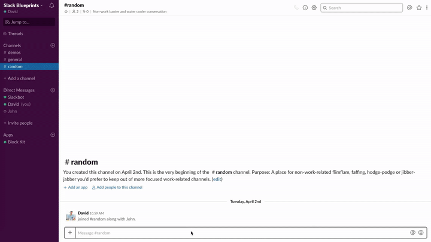

# Create task from Slash Command

  
*Create task from Slash Command*

### Examples

* Create a task through a Slash Command
* Create a ticket through a Slash Command

## Required features

* [Bot User](https://api.slack.com/bot-users)
* [Interactive Components](https://api.slack.com/interactive-messages)
* [Slash Commands](https://api.slack.com/slash-commands)

## Required scopes

* [`bot`](https://api.slack.com/scopes/bot)
* [`commands`](https://api.slack.com/scopes/commands)

## Implementation overview

### 1. Open modal through Slash Command

* [payload.json](payload-task-modal.json)

#### Methods

* [`views.open`](https://api.slack.com/methods/views.open)

### 2. Confirmation in DM

* [payload.json](payload-task-confirm.json)
* [Open in Block Kit Builder](https://api.slack.com/tools/block-kit-builder?blocks=%5B%7B%22type%22%3A%22section%22%2C%22text%22%3A%7B%22type%22%3A%22mrkdwn%22%2C%22text%22%3A%22Your%20task%20%3Cfakelink.toUser.com%7C*Review%20landing%20page%20design*%3E%20has%20been%20created%20%3Aok_hand%3A%22%7D%2C%22accessory%22%3A%7B%22type%22%3A%22button%22%2C%22text%22%3A%7B%22type%22%3A%22plain_text%22%2C%22text%22%3A%22%3Apencil%3A%20Edit%22%2C%22emoji%22%3Atrue%7D%2C%22value%22%3A%22edit%22%7D%7D%2C%7B%22type%22%3A%22divider%22%7D%2C%7B%22type%22%3A%22context%22%2C%22elements%22%3A%5B%7B%22type%22%3A%22mrkdwn%22%2C%22text%22%3A%22*Assignee%3A*%20%3CfakeLink.toUser.com%7C%40David%3E%22%7D%2C%7B%22type%22%3A%22mrkdwn%22%2C%22text%22%3A%22*Priority%3A*%20%3Aarrow_double_up%3A%20High%22%7D%2C%7B%22type%22%3A%22mrkdwn%22%2C%22text%22%3A%22*Labels%3A*%20Design%22%7D%5D%7D%2C%7B%22type%22%3A%22section%22%2C%22text%22%3A%7B%22type%22%3A%22mrkdwn%22%2C%22text%22%3A%22*Description*%5CnPlease%20review%20the%20new%20landing%20page%20design%22%7D%7D%5D)

#### Methods

* [`chat.postMessage`](https://api.slack.com/methods/chat.postMessage)
